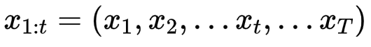
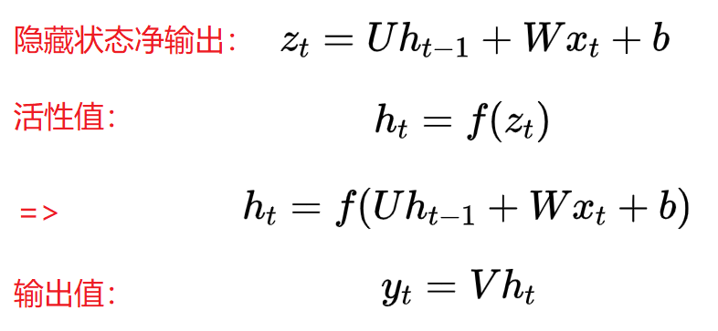
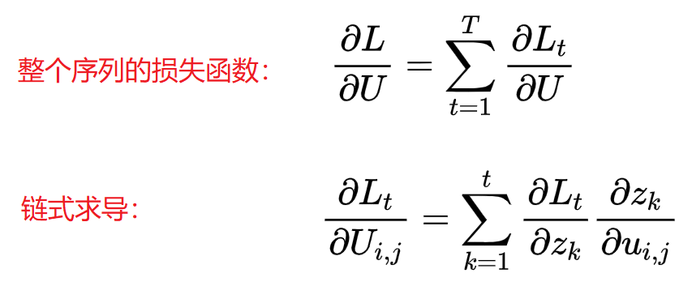

# `RNN 循环神经网络`

## `循环神经网络`

循环神经网络通过使用自反馈的神经元，能够处理任意长度的时序数据。

`给定一串输入数据：`

`RNN` 通过下面公式更新带反馈变的隐藏层的 `活性值 h(t)`

`RNN` 模型有比较多的变种，这里介绍最主流的RNN模型结构如下：

## `RNN 前向传播`
   
对于一个简单 RNN 网络在 t 时刻的更新公式为：

`其中：`

* `xt` 为 `t时刻网络的输入`

* `ht` 为 `t时刻隐藏层的活性值`，此时ht不仅和当前时刻的输入xt 有关，也和上一个时刻的隐藏状态值ht-1 相关。

* `zt` 为 `t时刻隐藏层的净输入`

* `U` 为 `状态权重矩阵`

* `W` 为 `状态输入矩阵`

* `b` 为 `偏置项`

* `f(·)` 为 `非线性激活函数` ，通常为 `Tanh`

## `反向传播：`

`定义损失函数 L` ，其中的 `g(ht)` 为 `t时刻` 的 `输出` 。

`整个序列的损失函数关于 U 求导：`

`对 U 进行求导：`

`补充：`

* `[hk-1]j` 意为第 `k-1时刻` 隐状态的 `j` 维，`i[]` 为除了第 `i` 行值为 `x` 外，其余都为 `0` 的 `行向量`。其实就是一个第 `i` 行的 `行向量`，其中第 `j` 列为` hk-1` 其他列为 `0`.

`最后：`

 

## `参考：`

`循环神经网络(RNN)模型与前向反向传播算法: `https://www.cnblogs.com/pinard/p/6509630.html