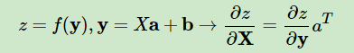
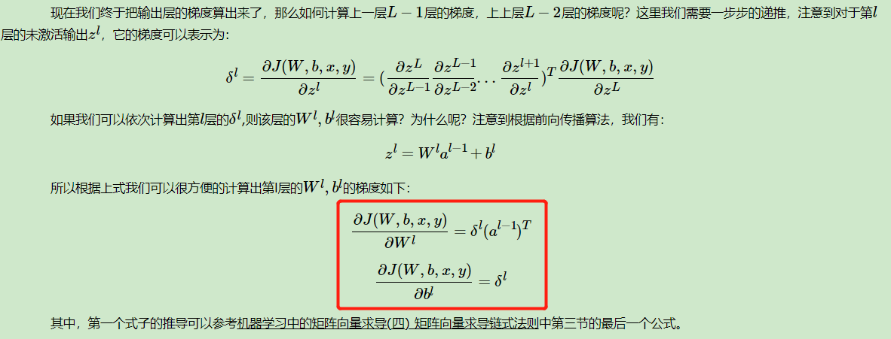
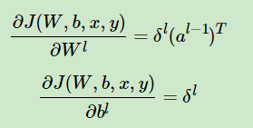
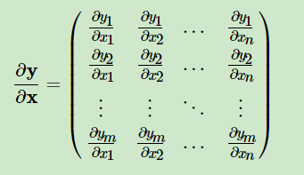

# `前向传播和反向传播`

前向传播用于构建模型，计算从输入值到输出值这个过程，而反向传播是求解模型参数的，从后往前推导，通过链式法则，一步步迭代更新模型的参数，获取最终模型。

## `前向传播`

## `反向传播`

`深度神经网络（DNN）反向传播算法(BP):` https://www.cnblogs.com/pinard/p/6422831.html#!comments

* `刘老师文章笔记(关于矩阵求导部分)：`

* `第一部分：`

    

    可以根据线性关系的链式求导结论：

    

    得到：

    * `da/dz * aT` 其中的 `da/dz` 就是哈达玛乘积中的两项

    根据逐元素求导：

    

* `第二部分：`

    

    

    可以根据线性关系的链式求导结论直接得到：

    

    `公式：`

    

    `根据公式可以表示成：`

    *    `da/dz * aT`  , 其中：`da/dz = δl `

    
    `则有：`

    

* `第三部分：`

    

    假设 `zl` 是 n 维向量，那么是一个 n 维向量对 n 维向量的求导。根据求导定义，`σ(zl)` 向量的每个维度都要对 `zl` 的每个维度分别求导，最后按分子布局排列成一个矩阵, 详细解释如下：

    比如 `m` 维列向量 `y` 对 `n` 维列向量 `x` 求导，`向量` 对 `向量` 求导，最终的结果 `通常` 是一个符合 `分子分布` 的 `雅克比矩阵`:

    

    如果符合 `分子分布`，那么最终得到的矩阵大小为 `m * n` 。

    可以看到对每个分量求导，除了对角线以外的其他分量导数为0 ，仅仅只有 yj = xi 的时候，导数有值。

## 参考

`深度神经网络（DNN）模型与前向传播算法:` https://www.cnblogs.com/pinard/p/6418668.html

`深度神经网络（DNN）反向传播算法(BP):` https://www.cnblogs.com/pinard/p/6422831.html#!comments

`Back Propagation（梯度反向传播）实例讲解：`https://zhuanlan.zhihu.com/p/40378224

