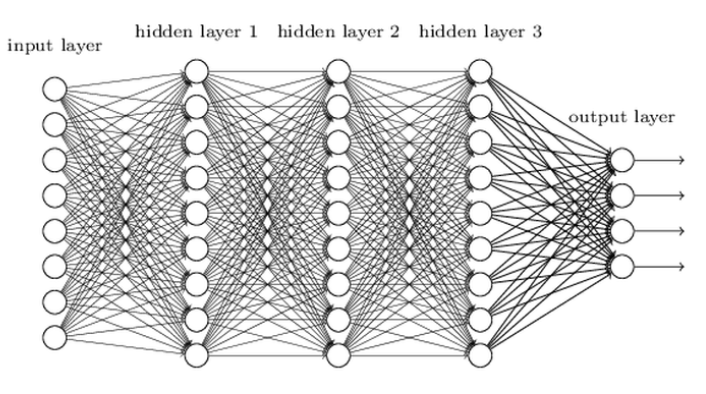
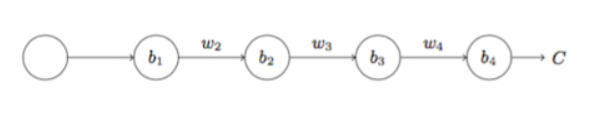
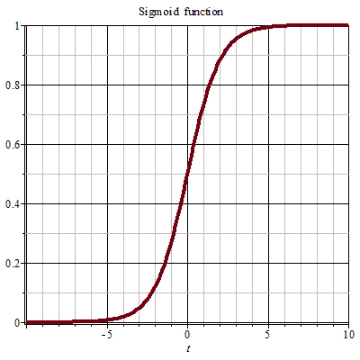
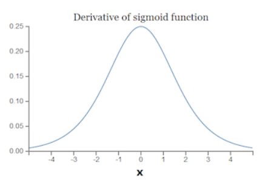

# `梯度消失和梯度爆炸`

梯度消失和梯度爆炸造成的原理类似，都是由于神经网络层数提升使得BP算法进行反向传播时，后层(layer 3)权重正常更新，但前面神经网络层(layer 1)权重几乎不变/变得很大造成。

## `梯度消失`

* 因为前向传播中讲到下一层是上一层经过 `线性变换 + 激活函数`（假设这里取激活函数为 `sigmoid`） 得到，如：

    

* `则有：`

    

* `此时我们有：`

    

* `那么进行反向传播时有：`

    

* `但是因为 sigmoid 函数的图像是：`

    

    可以看到当 t 越来越小，或者 t 越来越大时，导数接近于0，

*  `sigmoid 的导数，如下图：`

    

    可以发现 `sigmoid` 函数的导数最大值为 `0.25`，而我们通常取得 `w` 也是小于 `1` 的数，所以造成：

    `(σ'(zi) * w)  < 0.25`, 所以越前面的神经网络层求导的次数越多，造成求导的结果 `dC/db1` 越小，导数越小对 w 的更新就会很慢，甚至几乎不变，这就引起了 `梯度消失`。

## `梯度爆炸`

* 梯度爆炸的引起原因在于 `(σ'(zi) * w)  > 1` ,同样的，越前面的神经网络层求导次数越多，造成求导的结果 `dC/db1` 非常大，引起 `梯度爆炸`。

* `不过在神经网络中梯度消失比梯度爆炸更常见：`

    

## `解决方法`

`其实梯度爆炸和梯度消失问题都是因为网络太深，网络权值更新不稳定造成的，本质上是因为梯度反向传播中的连乘效应`。

对于更普遍的梯度消失问题，可以考虑用 `ReLU激活函数` 取代 `sigmoid激活函数` 。另外，LSTM 的结构设计也可以改善 RNN 中的梯度消失问题。

## `参考：`

* `神经网络训练中的梯度消失与梯度爆炸:` https://zhuanlan.zhihu.com/p/25631496

* `深度神经网络的梯度不稳定问题--梯度消失与梯度爆炸：`https://ziyubiti.github.io/2016/11/06/gradvanish/

* `从反向传播推导到梯度消失and爆炸的原因及解决方案（从DNN到RNN，内附详细反向传播公式推导）:` https://zhuanlan.zhihu.com/p/76772734