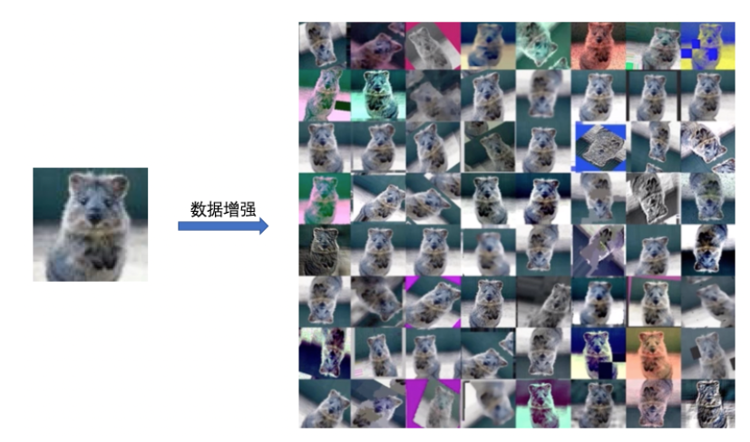

# `深度神经网络数据处理`

## `一、图片数据处理：`

## [一、数据增强：](https://paddlepedia.readthedocs.io/en/latest/tutorials/computer_vision/image_augmentation/ImageAugment.html)

* `数据增强 (Data Augmentation)` 又称为数据增广、数据扩增，它是对 `训练集` 进行变换，使训练集更丰富，从而让模型更具 `泛化能力`。

    

### `2、常用数据增广方法：`

* `2.1、标准数据增广方法：`在 `ImageNet` 分类任务中，训练阶段的标准数据增广方法为以下几步：

    * `1、图像解码：`简写为 `ImageDecode`

    * `2、随机裁剪到长宽均为 224 的图像：`简写为 `RandCrop`

    * `3、水平方向随机翻转：`简写为 `RandFlip`

    * `4、图像数据的归一化：`简写为 `Normalize`

    * `5、图像数据的重排：` `[224, 224, 3]` 变为 `[3, 224, 224]`：简写为 `Transpose`

    * `6、多幅图像数据组成 batch 数据：`如 `batch-size` 个 `[3, 224, 224]` 的图像数据拼组成 `[batch-size, 3, 224, 224]`：简写为 `Batch`

* `2.2、改进的图像增广策略：`相比于上述标准的图像增广方法，研究者也提出了很多改进的图像增广策略，这些策略均是在标准增广方法的不同阶段插入一定的操作，基于这些策略操作所处的不同阶段，我们将其分为了三类：

    * `1、`对 `RandCrop` (上述的阶段2)后的 224 的图像进行一些变换: AutoAugment，RandAugment

    * `2、`对 `Transpose` (上述的阶段5)后的 224 的图像进行一些裁剪: CutOut，RandErasing，HideAndSeek，GridMask

    * `3、`对 `Batch`(上述的阶段6) 后的数据进行混合: Mixup，Cutmix

    

### `3、数据增广案例：`

* `图像变换类：`https://paddlepedia.readthedocs.io/en/latest/tutorials/computer_vision/image_augmentation/ImageAugment.html#id3

## [二、PIL 库对图像数据处理：](https://pillow.readthedocs.io/en/stable/reference/Image.html)

* `1、img = img.convert() 函数：`

    `PIL` 有九种不同模式: `1，L，P，RGB，RGBA，CMYK，YCbCr，I，F`。

*  `1、img.convert('1')`

    二值图像，非黑即白。每个像素用8个bit表示，0表示黑，255表示白，代码如下：

        from PIL import Image

        def convert_1():
            image = Image.open("D:/pytorch_code/pytorch_study/fusion_datasets/1.jpg")
            image_1 = image.convert('1')
            image.show()
            image_1.show()

    

*  `2、img.convert('L')`

    为灰度图像，每个像素用8个bit表示，0表示黑，255表示白，其他数字表示不同的灰度。

    转换公式：L = R * 299/1000 + G * 587/1000+ B * 114/1000。

        from PIL import Image

        def convert_L():
            image = Image.open("D:/pytorch_code/pytorch_study/fusion_datasets/1.jpg")
            image_L = image.convert('L')
            image.show()
            image_L.show()

    

*  `3、img.convert('P')`

        from PIL import Image

        def convert_L():
            image = Image.open("D:/pytorch_code/pytorch_study/fusion_datasets/1.jpg")
            image_L = image.convert('P')
            image.show()
            image_L.show()

    

## `神经网络中的一些问题：`

* `1、为什么很多神经网络在处理图片之前都将图片裁剪成224*224：`

    分类任务输出特征图如果尺寸太小，那么信息就丢失太严重，如果尺寸太大，信息的抽象层次不够高，计算量也更大，`7×7` 的大小是一个很好的平衡。图像从大分辨率降低到小分辨率，降低倍数通常是2的指数次方，所以图像的输入一定是7*2的指数次方。以 `ImageNet` 为代表的大多数分类数据集，图像的长宽在 `300` 分辨率左右。

    所以要找一个 `7×2` 的指数次方，并且在 `300` 左右的分辨率作为输入，其中 $7×2^4=7×16=112$，$7×2^5=7*32=224$，$7×2^6=448$，与 300 最接近的就是 224 了。

## `参考链接：`

* `Lecture 07 数据预处理 transforms 模块机制：`https://yey.world/2020/12/11/Pytorch-07/

* `Lecture 08 transforms 数据增强：裁剪、翻转、旋转：`https://yey.world/2020/12/12/Pytorch-08/

* `Python图像处理 PIL中convert('L')函数原理：`https://www.cnblogs.com/haifwu/p/12825741.html

* `数据增广：`https://paddlepedia.readthedocs.io/en/latest/tutorials/computer_vision/image_augmentation/ImageAugment.html