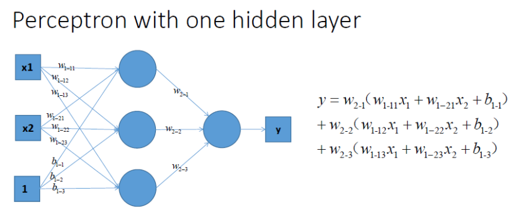
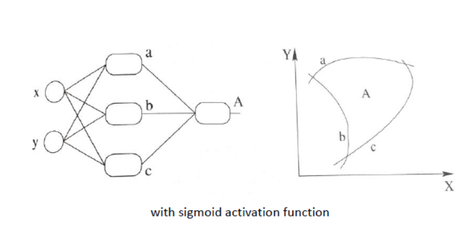

# 激活函数

## `激活函数的作用：`

激活函数引入非线性因素，从而解决线性模型所不能解决的问题。

图形展示：

* `线性模型：`

    

    没有激活函数，绘制的决策边界为线性的：

    

* `引入激活函数构造非线性模型：`

    

    引入激活函数，绘制的决策边界为非线性的：

    

## `激活函数的选择: `

## 参考：

`形象的解释神经网络激活函数的作用是什么？`: https://zhuanlan.zhihu.com/p/25279356

`深度神经网络（DNN）损失函数和激活函数的选择:` https://www.cnblogs.com/pinard/p/6437495.html

`Sklearn 与 TensorFlow 机器学习实用指南第二版:` https://hands1ml.apachecn.org/#/docs/10

