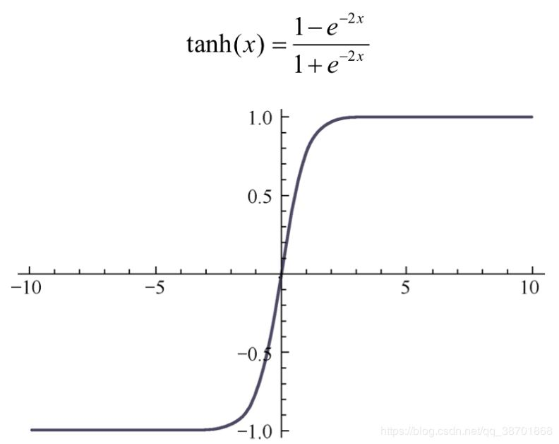
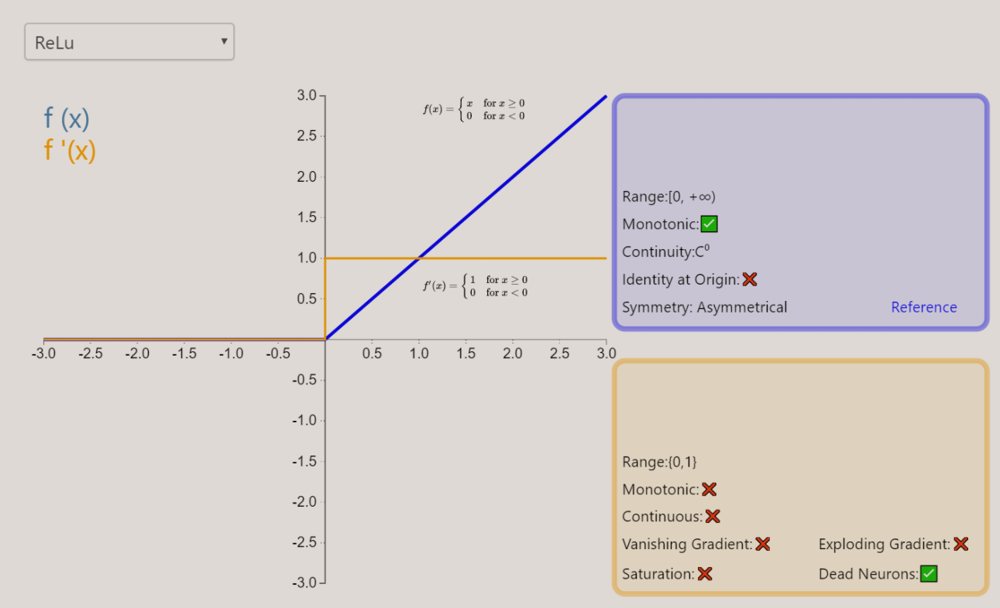
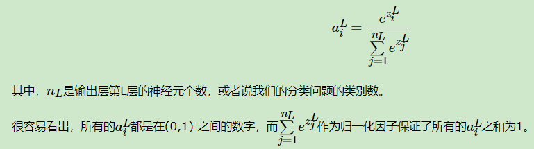
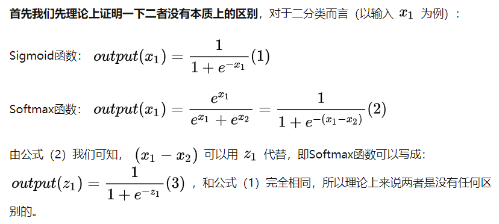

# 激活函数

## `一、激活函数的作用：`

激活函数引入非线性因素，从而解决线性模型所不能解决的问题。

图形展示：

* `线性模型：`

    

    没有激活函数，绘制的决策边界为线性的：

    

* `引入激活函数构造非线性模型：`

    

    引入激活函数，绘制的决策边界为非线性的：

    

## `二、激活函数：`

* `2.1、阶跃激活函数：`

    阶跃函数虽然不可导，但是分段还是可导的，所以一定要使用阶跃函数作为激活函数，也是可以的，但是求导和反向传播的计算要复杂一些（需要分段考虑），且没有得到更多算法性能的提升，所以就没有什么人使用了。

    逻辑回归不使用阶跃函数是的原因是因为：1、阶跃函数求导一直为0，不方便进行梯度下降。2、输出的值无法是概率

    阶跃函数这个很像CNN里面的池化层，里面是AVG和MAX得到的下一层，是无法直接求导反向传播的，但是可以通过特殊处理完成，具体可以查看[《卷积神经网络(CNN)反向传播算法》第三节](https://www.cnblogs.com/pinard/p/6494810.html)。

    这个原因总结的没问题的。虽然阶跃函数特殊处理仍然可以参与求导，但是逻辑回归是一个很简单的线性模型，这样复杂化的收益不高。输出值和sigmoid比，解释性也不够强，仅仅得到一个结果而已。

* `2.2、sigmoid 激活函数：`

    `Sigmoid` 导数取值范围是 `[0, 0.25]` ，由于神经网络反向传播时的 `链式法则` ，很容易就会出现梯度消失的情况。

    

* `2.3、tanh 激活函数：`

    非线性激活函数 tanh 将实数值输出到 -1 和 1 之间，当 tanh 的输出极值接近于 -1 和 1 时，也面临梯度饱和的问题，不过 `因为tanh的输出是以0为中心的`，所以比 sigmoid 更受偏爱，如图：

    

    

* `2.4、relu 激活函数：`

    `rule 函数：`$σ(z)=max(0,z)$

    

    * `ReLU 在 x> 0下，导数为常数 1 的特点：`
    
        导数为常数1 的好处就是在 `链式法则` 中不会出现梯度消失，但梯度下降的强度就完全取决于权值的乘积，这样就可能会出现梯度爆炸问题。

    * `ReLU 在 x<0 下，输出置为 0 的特点：`
    
        描述该特征前，需要明确深度学习的目标：深度学习是根据大批量样本数据，从错综复杂的数据关系中，找到关键信息（关键特征）。换句话说，就是把密集矩阵转化为稀疏矩阵，保留数据的关键信息，去除噪音，这样的模型就有了鲁棒性。 `ReLU` 将 `x<0` 的输出置为0，就是一个去噪音，稀疏矩阵的过程。而且在训练过程中，这种稀疏性是动态调节的，网络会自动调整稀疏比例，保证矩阵有最优的有效特征。

        但是 ReLU 强制将 `x<0` 部分的输出置为 0（置为0就是屏蔽该特征），可能会导致模型无法学习到有效特征，所以如果学习率设置的太大，就可能会导致网络的大部分神经元处于 ‘dead’ 状态，所以使用 ReLU 的网络，学习率不能设置太大。

* `2.5、softmax 激活函数：`

    `softmax` `用于解决多分类问题，DNN` 分类模型要求是输出层神经元输出的值在 `0` 到 `1` 之间，同时所有输出值之和为 `1`。很明显，现有的普通 `DNN` 是无法满足这个要求的。但是我们只需要对现有的全连接 `DNN` 稍作改良，即可用于解决分类问题。在现有的 `DNN` 模型中，我们可以将输出层第i个神经元的激活函数定义为如下形式：

    `softmax 的函数表达形式：`
    
    

    下面这个例子清晰的描述了 `softmax激活函数` 在前向传播算法时的使用。假设我们的输出层为三个神经元，而未激活的输出为 `3,1和-3` ，我们求出各自的指数表达式为：`20,2.7和0.05`，我们的归一化因子即为 `22.75` ，这样我们就求出了三个类别的概率输出分布为 `0.88，0.12和0` 。
    

    通过 `Softmax` 函数一作用，我们将最终结果映射成为 `(0,1)` 的值，而这些值的累和为1（满足概率的性质），那么我们就可以将它理解成概率，在最后选取输出结点的时候，我们就可以选取概率最大（也就是值对应最大的）结点，作为我们的预测目标。
    
    
    由于 `Softmax` 函数先拉大了输入向量元素之间的差异（通过指数函数），然后才归一化为一个概率分布，在应用到分类问题时，它使得各个类别的概率差异比较显著，最大值产生的概率更接近1，这样输出分布的形式更接近真实分布。

* `softmax` 和 `sigmoid` 函数在`二分类`时没有区别：

    

    `Softmax函数` 是二分类函数 `Sigmoid` 在多分类上的推广，目的是将多分类的结果以概率的形式展现出来。

## `激活函数的选择: `

## 参考：

`形象的解释神经网络激活函数的作用是什么？`: https://zhuanlan.zhihu.com/p/25279356

`深度神经网络（DNN）损失函数和激活函数的选择:` https://www.cnblogs.com/pinard/p/6437495.html

`Sklearn 与 TensorFlow 机器学习实用指南第二版:` https://hands1ml.apachecn.org/#/docs/10

`softmax,sigmoid函数在使用上的区别是什么？`https://www.zhihu.com/question/269431756/answer/1779010934

`26种神经网络激活函数和其导数曲线：`https://www.jiqizhixin.com/articles/2017-10-10-3