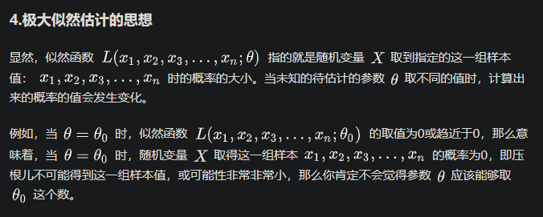

# 如何理解似然函数

## 一、极大似然估计思想 

## 二、似然函数公式：

* L(θ|x) 是似然函数，是通过已知的x求解最优参数θ

* P(X=x;θ) 是获取到 θ 后，X 发生的概率是多少，这个值如果越大，表示 θ 越精确

### 2.1、关于似然函数为什么是累乘：

* 首先 `P(x;θ)` 越大，就说明参数如果为 `θ`，你的观测数据 `x` 就越可能出现。那你既然已经观测到数据 `x` 了，那么越可能让这个 `x` 出现的参数 `θ`，就越是一个靠谱的模型参数。这个参数的靠谱程度，就是似然。

* 累乘是因为我们的样本不止一个，像上面我们是经过了 n 次的实验，我们需要让总的概率最大，总概率最大求解出来的 θ 就是最优参数，接着就演化成了求解极大似然函数。

* 极大似然估计的思想就是：设某时间A发生的概率依赖于位置参数θ，如果观察到A已经发生，那么就取θ的估计值使得A发生的概率最大。

### 如何求解似然函数的最大值

* 1、首先将似然函数转化成对数似然函数，方便计算。

* 2、当对θ求导等于0成立时，似然函数能得到极大值，因为对数函数是凹函数，当导数为0能取到极大值。

## 参考资料

* 为什么极大似然估计求导为 0 就是要求的值呢：https://www.zhihu.com/question/263423642/answer/269353169

* 如何理解似然函数：https://www.zhihu.com/question/54082000

* 通俗理解似然函数、概率、极大似然估计和对数似然：https://blog.csdn.net/jh1137921986/article/details/89000994

https://www.jianshu.com/p/fbd736a61927