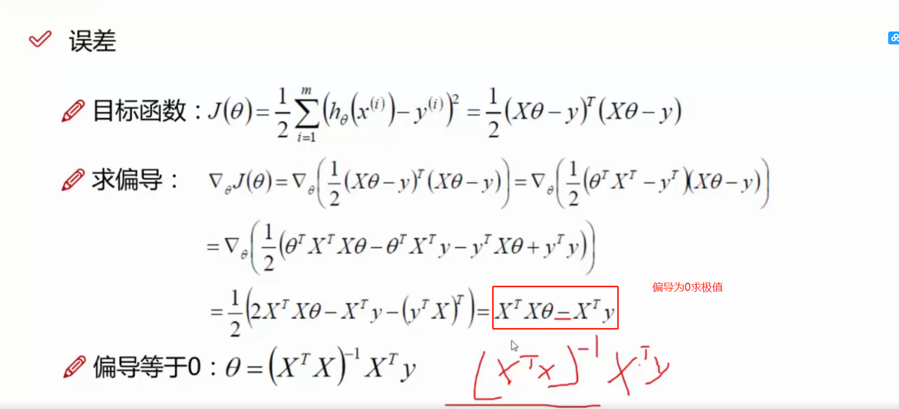

# 线性回归

估计类条件概率的一种常见的策略就是先假定其具有某种确定的概率分布形式，再基于训练样本对概率分布的参数进行估计。

事实上概率模型的训练过程就是 `参数估计` 的过程。并且统计学的两个学派分别提供了两种不同的解决方案，这里先采用频率学派的极大似然估计法，`频率学派认为参数虽然未知，但是确实客观存在的固定值，因此可以通过优化似然函数等准则来确定参数值`

## `一、线性回归公式：`
* 

## `二、回归是预测，存在误差，引入误差项`

预测值和真实值之间存在误差 ε ，如果要让预测值更准确，那么误差要越小越好

* 

## `三、假设误差服从正态分布`

机器学习中所有的内容都是基于假设，我们的数据必须是独立同分布的，不然没有意义。这里假设误差是基于标准正态分布

### `那为什么能将误差认为是正态分布呢？`

1. 大量独立的随机变量之和趋向于某个稳定的分布，这就是中心极限定理。

2. 后来人们给这种分布取了个名，叫高斯分布，或正态分布。

3. 人们认为误差是随机的，所以人们认为误差的和服从高斯分布。

不过，一般测量的误差是随机的，但机器学习中的误差是否随机就不一定了。

* 

### `正态分布公式：`

* 

## `四、得到y的概率密度函数`

将误差带入到正态分布的公式中，因为误差服从标准正态分布，那么μ=0，σ=1，这里暂时先只带入μ，公式中的 exp 其实就是 e，紧接着通过 1 式将 ε 转成对应表达式带入 2 式子，化成只带有 θ 的表达式。

* 

`如何从②转化到③是最难理解的一步。`

    首先需要理解的是， ε(i) = y(i) - θTX (i)，只有在给定了x的情况下，y才有取值的可能。

    p(x；θ)，在给定了θ情况下x的取值；
    
    f(y|x；θ)，在给定了x的情况下，还给定了某种参数θ的情况下，y的条件概率函数是多少；

    由于x和θ是一个定值，所以θTX (i)可以理解成才一个定值C。

    接着思考随机变量 ε(i)，误差期望值(均值)是0， E(ε(i)) = 0 => E(ε(i)+C) = C

    ε(i)是服从正态分布的(高斯分布)，ε(i)+C是一个服从均值为C，方差不变的正态分布。

    所以：既然y(i)= θTX (i) + ε(i)；y也是服从一个均值为(均值=θTX (i),方差= ε(i)的方差)的正态分布的。但是有一个前提条件：X和θ是被给定的。

## `五、似然函数和对数似然函数`

因为我们想要误差越来越小，那么我们就希望我们最终的预测值越接近真实值越好，那么我们就看可以通过极大似然估计对式子进行求解。

    PS：很多情况我们能看到p(x;θ)和p(x|θ)这两种写法

`所以公式③左侧的含义：在给定了x和某种参数θ的情况下y的概率密度函数。`

    ∵ 联合概率密度函数等于似然函数，L ( θ | x) = f (x | θ);

    ∴ 得出公式似然函数的公式是概率密度的乘积

*   [什么是极大似然估计？](https://www.zhihu.com/question/54082000)

* 

    
### `5.1、很多情况我们能看到p(x;θ)和p(x|θ)这两种写法`

* [p(x|θ) 不总是代表条件概率；也就是说 p(x|θ) 不代表条件概率时与 p(x;θ) 等价](https://blog.csdn.net/pipisorry/article/details/42715245)

## `六、极大似然估计和最小二乘法`

如果我们想要让logL(θ)尽可能大，那么B式就要尽可能小，B式其实就是最小二乘法的式子。其实一般线性回归我们直接用均方误差作为损失函数。损失函数的代数法表示如下：

* 

## `七、接下来求解 J(θ) 的极小值。`

* 

## [矩阵求导](https://zhuanlan.zhihu.com/p/24709748)

    1、 d/dx   Ax = A

    2、d/dx   x^T A x = 2Ax    A旁边有XT 和 X

## 参考资料：

* 回归算法 - 线性回归求解 θ（最大似然估计求解）和 p(y|x;θ)讲述：https://www.jianshu.com/p/fbd736a61927

* 刘建平 - 线性回归的模型函数和损失函数：https://www.cnblogs.com/pinard/p/6004041.html

* 概率论：p(x|theta)和p(x;theta)的区别：https://math.stackexchange.com/questions/3421665/do-the-vertical-bar-and-semicolon-denote-the-same-thing-in-the-context-of-condit

* 概率论：p(x|theta)和p(x;theta)的区别：https://blog.csdn.net/pipisorry/article/details/42715245

