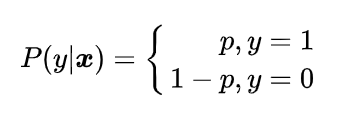
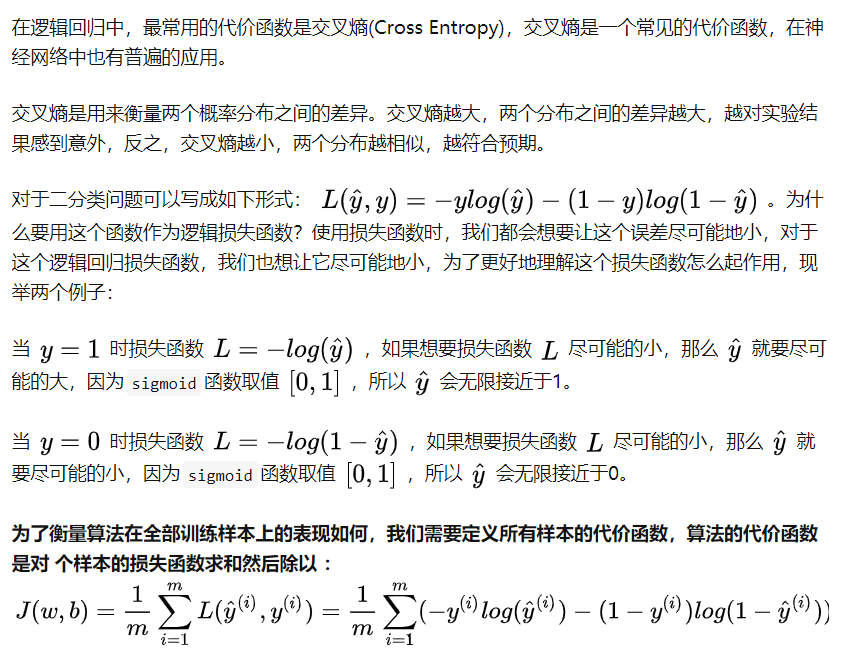

# 逻辑回归简介:

对于分类问题，线性回归无法预测，因为线性回归的到的是连续数据，所以引入了逻辑回归，逻辑回归名称中虽然带有回归，其实它是一种分类算法。主要解决的是一些二分类的问题，输出的值通常为0-1之间(借助sigmoid函数实现)，表示分属不同类别的概率。

逻辑回归的实现重点在于引入了 sigmoid function，sigmoid 函数能将线性回归产生的预测值转为 0 和 1 的映射。

## `Sigmoid函数`:

__`Sigmoid函数` 公式：__

__`Sigmoid函数` 表示图：__

我们可以看出， __`Sigmoid函数的取值是在0-1之间的，随着z的增大，最终的g(z)会越来越趋近于1，随着z的减小，最终的g(z)会越来越趋近于0`。__

__`逻辑回归算法是借助 Sigmoid 函数实现二分类`。__ 我们可以这样理解：要实现一个二分类任务，0 即为不发生，1 即为发生。我们给定一些历史数据 X 和 y。其中 X 代表样本的 n 个特征，y 代表正例和负例，也就是 0 或 1 的取值。通过历史样本的学习，我们可以得到一个模型，当给定新的 X 的时候，可以预测出 y。这里我们得到的 y 是一个预测的概率，通常不是 0% 和 100%，而是中间的取值，那么我们就可以认为概率大于 50% 的时候，即为发生（正例），概率小于 50% 的时候，即为不发生（负例）。这样就完成了二分类的预测。

## `线性回归 和 Sigmoid 的结合`

__结合 `sigmoid` 函数，`线性回归` 函数，把 `线性回归模型的输出作为sigmoid函数的输入` 。于是最后就变成了 `逻辑回归模型`：__

## 逻辑回归的损失函数：

假设只有两个标签 `1` 和 `0`，
 我们把采集到的任何一组样本看做一个事件的话，那么这个事件发生的概率假设为 p。

`我们的模型 y 的值等于标签为 1 的概率也就是 p`，则：

`标签为 0 的概率： 1 - p`

因为 `逻辑回归` 遵从 `伯努利分布`，我们把单个样本看做一个事件，那么这个事件发生的概率就是：

这个函数不方便计算，它等价于:

那么有 N 个样本，这个合成在一起的合事件发生的总概率其实就是将每一个样本发生的概率相乘就可以了，即采集到这组样本的概率：

这个函数 `f(w)` 又叫做它的`损失函数`。损失函数可以理解成衡量我们当前的模型的输出结果，跟实际的输出结果之间的差距的一种函数。`这里的损失函数的值等于事件发生的总概率，我们希望它越大越好`。

之后就可以通过极大似然估计来求得最优 W 参数，使其满足事件发生的总概率值最大。

### `使用 交叉熵 来作为 loss function 的好处：`

## 参考资料：

* [逻辑回归 logistics regression 公式推导](https://zhuanlan.zhihu.com/p/44591359)

* [逻辑回归的损失函数](https://www.zhihu.com/question/272058718/answer/971718593)

