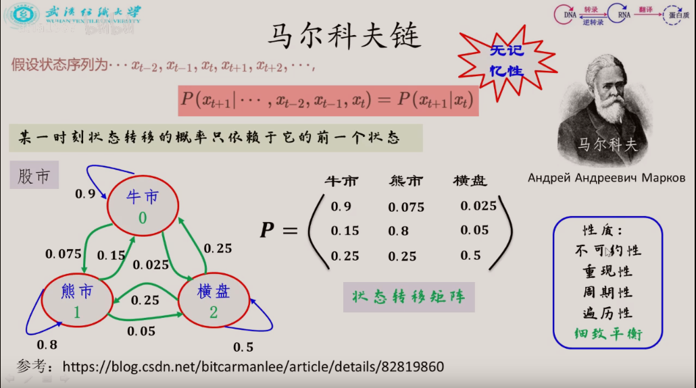
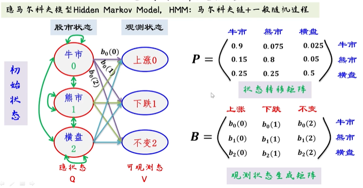
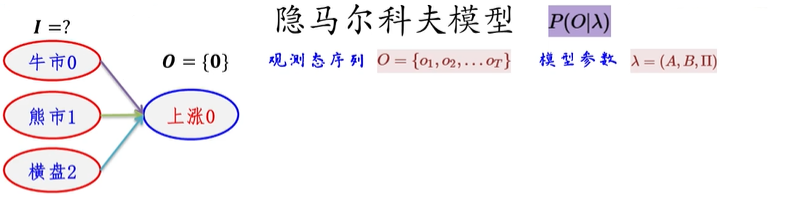
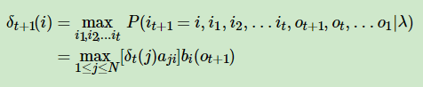
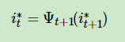
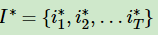
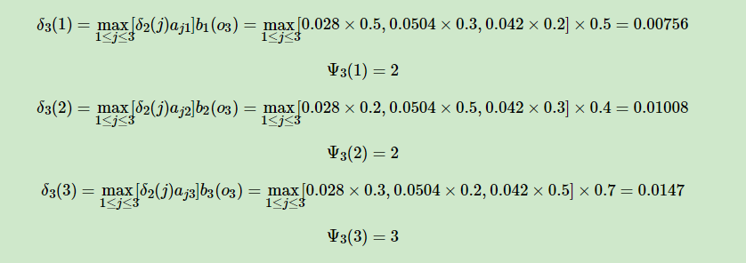
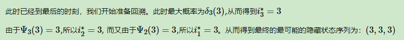

# 隐马尔可夫模型

## `马尔科夫性质：`

* 马尔科夫链遵从马尔可夫性质：也就是未来状态的条件概率分布只依赖于当前时刻：

    

## `马尔可夫模型：`

* 既然某一时刻状态转移的概率只依赖于它的前一个状态，那么我们只要能求出系统中任意两个状态之间的转换概率，这个马尔科夫链的模型就定了。

* 下图马尔科夫链是表示股市模型的，共有三种状态：牛市（Bull market）, 熊市（Bear market）和横盘（Stagnant market）。每一个状态都以一定的概率转化到下一个状态。比如，牛市以0.025的概率转化到横盘的状态。这个状态概率转化图可以以矩阵的形式表示。如果我们定义矩阵阵P某一位置P(i,j)的值为P(j|i),即从状态i转化到状态j的概率，并定义牛市为状态0， 熊市为状态1, 横盘为状态2. 这样我们得到了马尔科夫链模型的状态转移矩阵。

    

* 有了状态转移矩阵之后就可以预测下一次的状态的概率是多少，比如今天 `牛市的概率为30%` ， `熊盘的概率为40%` ，`横盘的概率为30%` ，也就是 `[0.3,0.4,0.3]`

    然后这个状态作为序列概率分布的 `初始状态 t0 [0.3,0.4,0.3]`，将其带入这个状态转移矩阵计算 `t1` , `t2` , `t3` ...的状态。

    下一个状态依赖于当前状态：`t1 = t0 * 状态转移矩阵`

### 代码示例：

    import numpy as np
    matrix = np.matrix([[0.9,0.075,0.025],[0.15,0.8,0.05],[0.25,0.25,0.5]], dtype=float)
    vector1 = np.matrix([[0.3,0.4,0.3]], dtype=float)
    for i in range(100):
        vector1 = vector1 * matrix
        print("Current round:" , i+1)
        print(vector1)

    --> 60次轮询后，可以看到最后得到的状态概率分布已经不变，成为平稳分布。<--

    Current round: 1
    [[ 0.405   0.4175  0.1775]]
    Current round: 2
    [[ 0.4715   0.40875  0.11975]]
    Current round: 3
    [[ 0.5156  0.3923  0.0921]]
    Current round: 4
    [[ 0.54591   0.375535  0.078555]]
    。。。。。。
    Current round: 58
    [[ 0.62499999  0.31250001  0.0625    ]]
    Current round: 59
    [[ 0.62499999  0.3125      0.0625    ]]
    Current round: 60
    [[ 0.625   0.3125  0.0625]]
    。。。。。。
    Current round: 99
    [[ 0.625   0.3125  0.0625]]
    Current round: 100
    [[ 0.625   0.3125  0.0625]]

### `马尔科夫链模型状态转移矩阵的性质`

* 不论你当前状态是什么，通过状态转移矩阵，最后都能得到一个平稳的概率分布。也就是说我们的马尔科夫链模型的状态转移矩阵收敛到的稳定概率分布与我们的初始状态概率分布无关。

### `马尔可夫状态转移矩阵`

* 马尔可夫状态转移矩阵必须满足：所有状态可遍历性和非周期性。

   

* `周期性：`https://www.zhihu.com/question/366011083

## 隐马尔科夫模型

* 股市状态是 `隐状态`，上涨下跌不变是 `观测状态`。

    

* 补充说明：

  一、`股市状态` 到 `观测状态：`

  * 其中的 `b0(0)` 为当前状态为牛市，它上涨的概率

  * 其中的 `b0(1)` 为当前状态为牛市，它下跌的概率

  * 其中的 `b0(2)` 为当前状态为牛市，它不变的概率

  意味着只要知道股市的状态结合观测状态生成矩阵我们就可以得到观测状态发生的概率。

  二、`股市自身的状态转移：`
    
    * 可以写成状态转移矩阵的形式。

    `股市状态` 的判断是一个 `马尔科夫链` ，股市状态到`观测状态的过程` 称为 `一般随机过程` ，所以说隐马尔科夫模型是 `马尔科夫链` + `一般随机过程`

### `HMM 模型`

定义一个 `HMM` 模型 `λ` ：

通过 `状态转移矩阵`、`观测状态生成矩阵`、`隐状态初始概率分布` 我们就可以构造一个 `HMM 模型`。

隐状态初始概率分布和状态转移矩阵，我们就可以知道任意时刻的状态是如何演化。

有了各个时刻的隐状态，再结合观测状态生成矩阵，就可以知道观测的东西随时间是如何演化的。

### `隐马尔科夫模型的两个假设：`

* `假设1、齐次马尔科夫假设：`即 `t+1 时刻` 只和 `t时刻` 有关。

* `假设2、观测独立假设：`当前观测变量 `Ot(观测变量t)` 只和 `It(隐状态t)` 有关

### `HMM 的三个基本问题：`

`λ 是 HMM 模型`

* 1、`评估问题：`观测的东西随时间是如何演化的概率分别是多少

    

    在 λ 这个模型的条件下，O 这个观测序列的概率是多少。

* 2、`模型参数的学习问题：`通过已有的数据来推断模型是什么，即推断 λ 是什么。

    

    通过发生的事情来推断最有可能的 HMM 模型参数。

* 3、`预测(解码)问题：` 知道模型`λ`、`O(观测序列)` 找出使得出现这个观测序列概率最大的 `I(状态序列)` 。

    

    根据 `模型` 和 `观测序列` 来推 `隐状态序列`。

### 第一个问题：`求观测序列的概率` (通过前向后向算法求解)

* 给了`参数模型 λ` 和 `观测状态序列 O` ，现在要求得是发生这种情况的可能性 `P(O|λ)` 有多大。 

    

* 观测给定模型的情况下，当前观测序列发生的概率 `P(O|λ)` <-- 就是我们要求解的。

* 也可以写成：`P(O|λ) = Σ P(O,I|λ)` 在模型已知的情况下给定隐状态的时候观测序列发生的概率之和。 

* 现在我们知道了 `P(O|λ) = Σ P(O,I|λ)` 那么 `Σ P(O,I|λ)` 如何求解呢？

    * 得到在 `λ` 条件下，当 `I = 某个状态`,出现 `O` 这个观测序列的概率： `P(O,I|λ) = P(I|λ) * P(O|I,λ)`

    * 其中 `P(I|λ) = π(i1) * a(i1,i2) * a(i2,i3)...a(ir-1,ir)`
    
        其中 `a(i1,i2)` 表 `i1时刻` 转到 `i2时刻` 的概率。

    * `P(O|i,λ) = bi1(o1)bi2(o2)...bir(or)` 的概率
    
* 则有：

     

    但是算法存在问题，`当隐藏状态较多的时候求解难度大`，他的 `复杂度是 O(N^T)`。

     

    即：每个 `隐变量 i ` 都对应这有 `N 个状态序列`，序列的长度为 `T` ，那复杂度就是 `N` 的 `T` 次方。

`前向和后相算法：`

* `前向概率：`

    在前向算法中，通过定义 `“前向概率”` 来定义动态规划的这个局部状态。什么是前向概率呢, 其实定义很简单，记为：

    

    即为在 λ 模型给定的情况下，定义时刻t时隐藏状态为 `qi`, 观测状态的序列为 `o1,o2,...ot` 的概率为前向概率。

    `前向算法公式：`

    

    中括号意思就是当前层的所有 `N个隐状态` 与下一层的 `第i个状态` 的连接，里面的 `α` 是到 `时刻t` 部分 `观测序列为 o1,o2,...ot` ，且在 `t 时刻` 处于 `状态 j` 的概率，`a` 是 `t 时刻` 第 `j 个状态` 到 `t+1 时刻` 第 `i 个状态` 的转移情况（转移矩阵给出）；
    
    `中括号` 外面乘以的 `b` 是当前状态下，`对应观测情况发生的概率`，比如当前是牛市，那么牛市对应上涨的概率是什么呢? 就是b。

    

    `前向算法推导：`

    

    其中第三行到第四行使用的是假设2：观测变量独立假设

    `总结得到：`

    

    `案例：`

    

    

* `后向概率：`

    `文字说明：`

    

    `后向概率推导：`

    

    `隐马尔科夫模型HMM（二）前向后向算法评估观察序列概率：`https://www.cnblogs.com/pinard/p/6955871.html#!comments

    `HMM模型 - 前后向算法：`http://www.armigo.fun/2020/02/23/HMM/

### `第二个问题：鲍姆-韦尔奇算法求解 HMM 参数`

* 借助 ` EM` 算法求解：

    

    `机器学习-白板推导系列(十四)-隐马尔可夫模型HMM（Hidden Markov Model）笔记：`https://zhuanlan.zhihu.com/p/380298879

    

    `隐马尔科夫模型HMM（三）鲍姆-韦尔奇算法求解HMM参数: `https://www.cnblogs.com/pinard/p/6972299.html#!comments

### `第三个问题: 维特比算法解码隐藏状态序列`

`解码问题：`知道模型`λ`、`O(观测序列)` 找出使得出现这个观测序列概率最大的 `I(状态序列)`

维特比算法需要先定义两个局部状态：

* 第一个局部状态是在 `时刻t` 隐藏状态为 `i` 所有可能的状态转移路径 `i1,i2,...it` 中的概率最大值。记为 `δt(i)`:

    

* 则有递推关系式,即 `t+1 时刻 `状态为 `i` 状态转移路径为 `i1,i2... it` 中概率的最大值：

    

* 第二个局部状态由第一个局部状态递推得到。即 `t 时刻` 隐藏状态为 `i` ，它的前一时刻 `t-1 时刻` 的最大概率 `隐藏状态` 记为 `Ψt(i)`。

    

*  `δt(i)` 记 t 时刻 状态转移路径概率的最大值，`Ψt(i)` 记 t-1 时刻的隐状态是谁

`有了这两个局部状态，我们就可以从时刻0一直递推到时刻T，然后利用Ψt(i)记录的前一个最可能的状态节点回溯，直到找到最优的隐藏状态序列。`

### `维特比算法流程：`

* 1、初始化状态：

    

* 2、迭代计算 `t = 2、3、4 ... T` 时刻的局部状态：

    

* 3、计算现在这个状态，可能成为的下一个隐状态的概率，计算出所有可能的状态转移概率之后，将状态转移概率最大路径概率的记为 `P*` ，将概率最大的隐状态节点记为 `i*T`。

    

* 4、通过局部状态 `Ψ(i)` 开始回溯:

    `Ψ(i)` 表示的就是 `t -1 时刻` 转移到 `t 时刻` 概率最大的隐状态是什么。

    

    通过回溯就能将所有的概率最大的转移隐状态路径都记录下来，最终知道，在模型`λ`、`O(观测序列)`已知条件下最可能出现的 `I(状态序列)`

    

### `案例：`

* 如图：

    

现在有三个箱子 `Box1、Box2、Box3`，其中放若干个 `白球` 和 `红球` ，个数如图所示，其中选中 `Box1` 的初始概率为 `0.2` `、Box2` 为 `0.4`、`Box3` 为 `0.4`，`状态转移矩阵如 A` ，`观测状态概率矩阵如 B`。

现有观测序列为：`O = {红、白、红}` 推测最有可能的隐状态序列 `I` 。

* `流程：`

    1、初始化 `δt(i)` ，记下 `t-1 时刻` 到 `t时刻` 转移概率最大的 `隐状态` 为 `Ψt(i)`：
    
        δ1(1) 表示 t=1 ,取到隐状态为 Box1 的概率 = 0.1 
        δ1(2) 表示 t=1 ,取到隐状态为 Box2 的概率 = 0.16
        δ1(3) 表示 t=1 ,取到隐状态为 Box3 的概率 = 0.28

        因为是第一次取，所以 Ψt(i) = 0
    
    2、根据公式，迭代生成 `δ2(i)`：

        δ2(1) 方括号中的内容表示 t=1 时刻状态为 Box1、Box2、Box3 这三种隐状态，在 t = 2 取到隐状态为 Box1 的可能性。

            乘以 b1(o2) 表示，在 Box1 中取到白球的概率。

        δ2(2) 方括号中的内容表示 t=1 时刻状态为 Box1、Box2、Box3 这三种隐状态，在 t = 2 取到隐状态为 Box2 的可能性。

            乘以 b2(o2) 表示，在 Box2 中取到白球的概率。

        δ2(3) 方括号中的内容表示 t=1 时刻状态为 Box1、Box2、Box3 这三种隐状态，在 t = 2 取到隐状态为 Box3 的可能性。

            乘以 b3(o2) 表示，在 Box3 中取到白球的概率。

        并且记下最有可能转移到当前隐状态的上一个隐状态为 Ψt(i)：

            Ψ2(1) = 3，Ψ2(2) = 3，Ψ2(3) = 3

            因为在 Box1 max 式子中 0.28 * 0.2 概率最大，Box2 ，Box3 同理。 

    3、根据公式，迭代生成 `δ3(i)`，详细计算步骤：

    

    4、`开始回溯`：

    

    注意：最后 `时刻 t` 选概率最大的 `δ` 作为隐状态开始回溯，`t时刻` 之前的隐状态都是由 `Ψ` 回溯给出，和 `δ` 的概率大小无关了。
    
    比如： `Ψ3(3) = 3` ，所以 `i*2` 记录的隐状态为 `3`，也就是在 `t=2` 时刻的 `Box3` 中找` Ψ2(3)`，里面记录的隐状态为 `3` ，结束回溯。因为 `Ψ2(3)` 记录的是前一时刻的 `t = 2-1 = 1 时刻` 的隐状态，所以搜索结束，状态序列为 `(3,3,3)`。

`隐马尔科夫模型HMM（四）维特比算法解码隐藏状态序列: `https://www.cnblogs.com/pinard/p/6991852.html

## `参考：`

* `MCMC(二)马尔科夫链：`https://www.cnblogs.com/pinard/p/6632399.html

* `HMM模型：`http://www.armigo.fun/2020/02/23/HMM/

* `第一个问题：隐马尔科夫模型HMM（二）前向后向算法评估观察序列概率：`https://www.cnblogs.com/pinard/p/6955871.html#!comments

* `机器学习-白板推导系列(十四)-隐马尔可夫模型HMM（Hidden Markov Model）笔记：`https://zhuanlan.zhihu.com/p/380298879

* `Video - 隐马尔科夫模型详解：`https://www.bilibili.com/video/BV13C4y1W7iB

