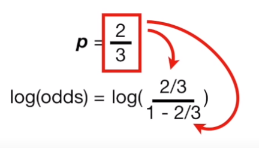
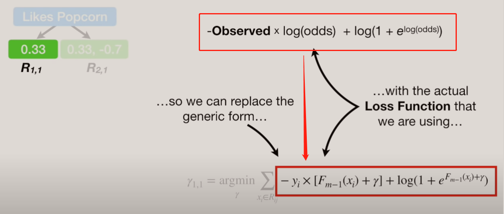
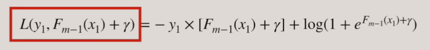

# GBDT_Classifiction

`注意：`公式中的 `log` 是以 `e` 为底的 `ln`

## `数据`

## `多元 GBDT分类算法 - 损失函数`

假设类别数为N，则此时我们的 `对数似然损失函数` 为：

最小化 `损失函数` 其实就是在 `似然函数` 前面加一个 `负号` 可得：

可以将 `预测概率为 p ` 的函数转化成，预测 `对数赔率` 函数

* `3) 中` `log(p) - log(1-p)` 等于 `log(p/(1-p))` = `log(odds)`，`log(odds)` 表示 `对数赔率`，进而到了 `4)` 。

* `4)` 到 `5)` 如下所示，将包含 `p` 的函数转成包含 `log(odds)` 的函数：

    

此时：这个包含 `对数赔率` 的函数 `5)` ，就是 `损失函数`。

### `概率 p 的计算公式：`

* `yi：`对于二分类，正例即为1，负例即为 0。

* `p：`预测概率，计算步骤如下：

    

    
    `注意：`公式中的 `log` 是以 `e` 为底的 `ln`:

    喜欢 `Loves Troll 2` 的人数为 `2`，不喜欢的人数为 `1` ，则有： 

        log(odds) = ln(2/1) = ln(2) ≈ 0.7
        ln
        p = e ^ log(odds) / (1+ e ^ log(odds)) = e ^ 0.7 / (1+ e ^ 0.7) ≈ 0.67 

## 流程：

### `第一次迭代：`

### `Step 1：`

* 初始化模型 `F0(x)`：

    

    * `公式介绍：`

        其中 `y` 为观察值 `observed`，`γ` 指理论上的对数赔率值 `log(odds)`。

    接下来将 `y` 和 `gamma` 代入到表达式中，得到：

    

    可以将 `对数赔率函数` 转化成 `概率p的函数` ，因为要 `最小化损失函数`，所以求导为 `0` 可得，p = 2/3:

    

    将` p = 2/3` 代入到 `log(odds)` 中，得到 `F0(x) = log(odds) = log(2/1) = 0.69`

    

### `Step 2：`

* 流程：

    

* `第一步 A) `：`计算负梯度`，简化得到结果为：`Observed - p`

    

    通过 step 1 我们可以得到 p = 2/3 = 0.67

    那么我们可以得到 负梯度的值 `rim` 为：`Observed - p` ： 

        r11 = 1 - 0.67 = 0.33

        r21 = 1 - 0.67 = 0.33

        r31 = 0 - 0.67 = -0.67

    得到，`负梯度的值`：

    

* `第二步 B)` ：`分配叶子节点`，`Rjm` 。

    

* `第三步 C)` ：`对每个叶子节点计算最小损失值`, 其中 `yjm` ：

    * `m：`为索引，表示地几棵树

    * `j：`为每片叶子的索引

    

    * 根据公式，有：

        

    * 将 `损失函数` 代入到公式中可得：

        

    * 接下来我们要计算 `γ` 的最佳值，其中我们可以通过直接求导为0的方法来得到，但是这样计算比较复杂，所以我们采用 `gbdt_regression` 方法，首先 `损失函数` 等于该式子：

    
        

    * 因为直接求导方式得到最优 `γ` 比较难，所以我们可以通过近似的方式，把 `损失函数` 进行 `泰勒二项展开` 进行近似：

        

    * 然后进行求导操作，得到如下式子：

        

    * 将导数设为0，此时我们就得到了 `γ` 的表达式

        

    * `γ` 表达式中的分子，其实就是我们之前求解的损失函数的负梯度，`observed - p`

    * `γ` 表达式中的分母，其实就是我们之前求解的损失函数的负梯度，再次求导：

        

        

        在前面的计算中，我们已经得到 log(1-p) 的值，这里可以直接拿来引用。

        

        最后我们得到：`γ` 的分母为：`p * (1-p)`

        

        其中 `Residual(残差)` 就是 `observed - p`

    * 得到 `γ` 的表达式之后，我们就可以计算 `步骤c`：

        `γ1,1:`
        

        [γ2,1 计算步骤，可点击:](https://www.youtube.com/watch?v=StWY5QWMXCw&t=1567s)
        

* `第四步 D) `：添加学习率，更新模型，得到 `F1(x)` 的结果：

    

### `接下来进行，第二次迭代：`

* 比如，按照年龄是否 `大于 65 `来划分：

    

`第一步`：计算 `ri,2 （负梯度）` ：

*  其实在之前我们就已经得到了 负梯度的公式为 `observed - p `

        p = e ^ log(odds) / (1+ e ^ log(odds))

    `样本1： `
    
        不满足 > 65 岁，并且喜欢 Troll 2，那么他的 observed = 1
    
        log(odds) 的值其实就是之前模型 F1(X) 得到的结果，即 1.89

        p 通过计算可得：e^1.89 / (1 + e^1.89) ≈ 0.87 

        所以 observed - p = 1 - 0.87 = 0.13

    `样本2：`

        满足 > 65 岁，所以在分叶子节点的时候他会在另一侧，并且喜欢 Troll 2，那么他的 observed = 1
    
        log(odds) 的值其实就是之前模型 F1(X) 得到的结果，即 0.07

        p 通过计算可得：e^0.07 / (1 + e^0.07) ≈ 0.52

        所以 observed - p = 1 - 0.52 = 0.48

    `样本3：`

        不满足 > 65 岁，并且不喜欢 Troll 2，那么他的 observed = 0

        log(odds) 的值其实就是之前模型 F1(X) 得到的结果，即 0.07

        p 通过计算可得：e^0.07 / (1 + e^0.07) ≈ 0.52

        所以 observed - p = 0 - 0.52 = -0.52
            

`第二步`：负梯度计算完成之后 `划分叶子节点`：

`第三步`：最优化 `γ`，得到 `γ` 的值：

`第四步`：添加学习率，更新模型：

### `预测：`

因为是分类预测，所以最后我们都希望得到的结果是一个概率形式，首先经过 `m` 次迭代，我们得到模型 `Fm(x)` 的值，这个值就是 `log(odds) 对数赔率`，然后根据 `p` 的计算公式计算出最后的概率，然后根据划分的阈值进行分类。

最后的到的结果为 0.97 > 0.05 所以预测为 喜欢 Troll2 。
 

## 要点说明：

### `一、赔率：`

## 参考资料

* https://www.youtube.com/watch?v=StWY5QWMXCw&t=1567s

