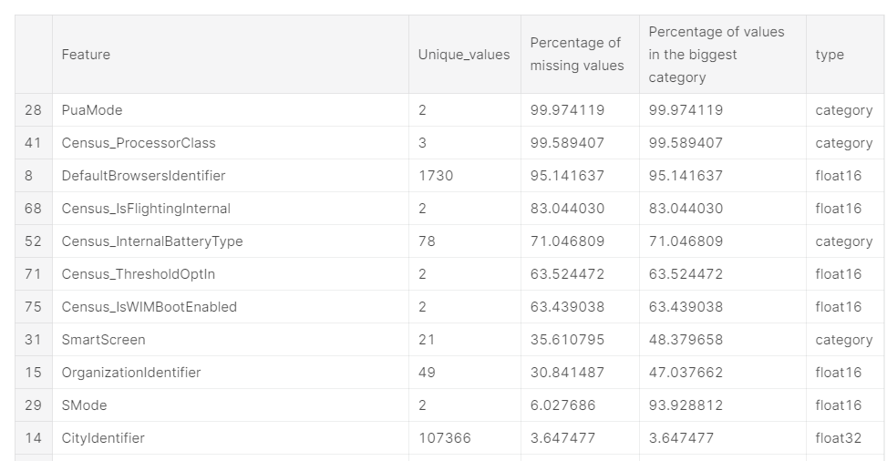
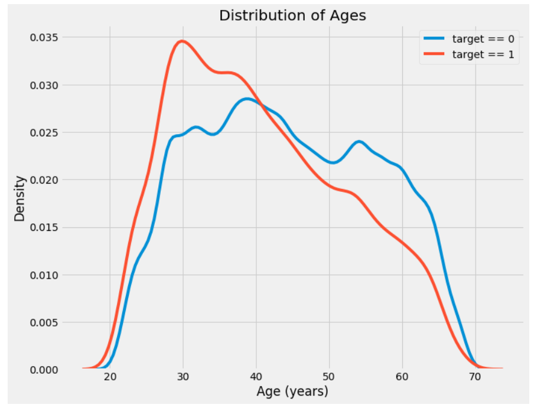
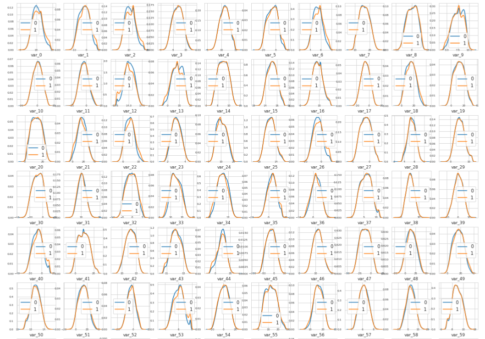
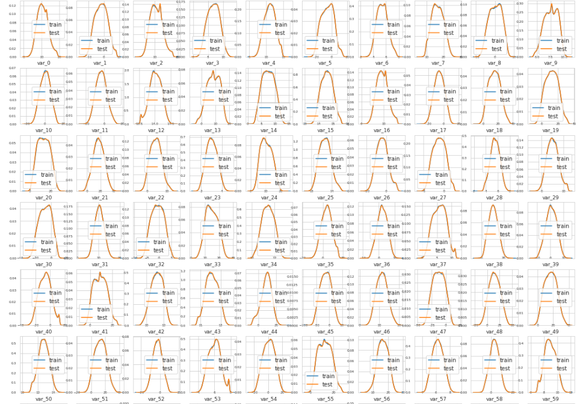
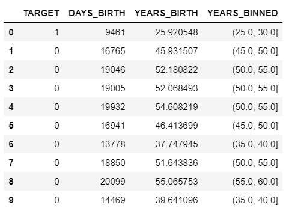

    # 数据清洗

* [特征预处理](https://github.com/OneStepAndTwoSteps/Data_Analysis_notes/tree/master/2%E3%80%81%E6%95%B0%E6%8D%AE%E5%88%86%E6%9E%90%E3%80%81%E6%9C%BA%E5%99%A8%E5%AD%A6%E4%B9%A0/%E6%95%B0%E6%8D%AE%E6%B8%85%E6%B4%97%E5%92%8C%E7%89%B9%E5%BE%81%E5%B7%A5%E7%A8%8B/%E7%89%B9%E5%BE%81%E9%A2%84%E5%A4%84%E7%90%86)

## `数据统一检查：`

`模板：`

    train = pd.read_csv('.....')

    stats = []
    for col in train.columns:
        stats.append((col, train[col].nunique(), train[col].isnull().sum() * 100 / train.shape[0], train[col].value_counts(normalize=True, dropna=False).values[0] * 100, train[col].dtype))
    
    # 列分别为 特征名、该特征独立值数量、该特征缺失值比例、该特征下出现最多的值占所有值的比例、数据类型
    stats_df = pd.DataFrame(stats, columns=['Feature', 'Unique_values', 'Percentage of missing values', 'Percentage of values in the biggest category', 'type'])
    stats_df.sort_values('Percentage of missing values', ascending=False)

`展示：`

针对性处理：

对于 `Percentage of values in the biggest category` 比例越大的数值表示该特征所带来的价值越小，所以对于比例很大的特征，我们可以丢弃：

模板:

    good_cols = list(train.columns)
    for col in train.columns:
        rate = train[col].value_counts(normalize=True, dropna=False).values[0]
        # 比例超过 90% 进行丢弃
        if rate > 0.9:
            good_cols.remove(col)

## `一、缺失值处理`

### `1.1、检查缺失值`

`模板：`

    # Function to calculate missing values by column# Funct 
    def missing_values_table(df):
            # Total missing values
            mis_val = df.isnull().sum()
            
            # Percentage of missing values
            mis_val_percent = 100 * df.isnull().sum() / len(df)
            
            # Make a table with the results
            mis_val_table = pd.concat([mis_val, mis_val_percent], axis=1)
            
            # Rename the columns
            mis_val_table_ren_columns = mis_val_table.rename(
            columns = {0 : 'Missing Values', 1 : '% of Total Values'})
            
            # Sort the table by percentage of missing descending
            mis_val_table_ren_columns = mis_val_table_ren_columns[
                mis_val_table_ren_columns.iloc[:,1] != 0].sort_values(
            '% of Total Values', ascending=False).round(1)
            
            # Print some summary information
            print ("Your selected dataframe has " + str(df.shape[1]) + " columns.\n"      
                "There are " + str(mis_val_table_ren_columns.shape[0]) +
                " columns that have missing values.")
            
            # Return the dataframe with missing information
            return mis_val_table_ren_columns

`案例：`

    # Missing values statistics
    missing_values = missing_values_table(app_train)  # app_train 是一个 dataframe
    missing_values.head(20)

`输出：`

    Your selected dataframe has 122 columns.
    There are 67 columns that have missing values.

### `1.2、缺失值处理`

进一步的，我们可以对缺失值进行操作，一般来说，当某列数据的缺失值超过90%时，我们可以对其进行删除操作。

`案例：`

* `1、`获取 `训练数据` 中缺失值百分比大于 `90%` 的列名

        missing_train_vars = list(missing_train.index[missing_train['% of Total Values'] > 90])
        len(missing_train_vars)

* `2、`我们需要对齐测试和训练数据框，这意味着要匹配各列，以便它们具有完全相同的列。 特别当我们进行热编码变量时，我们需要对齐数据框以确保它们具有相同的列。

        train_labels = train['TARGET']

        # Align the dataframes, this will remove the 'TARGET' column
        train, test = train.align(test, join = 'inner', axis = 1)

        train['TARGET'] = train_labels

        print('Training Data Shape: ', train.shape)
        print('Testing Data Shape: ', test.shape)

* `3、`获取 `测试数据` 中缺失值百分比大于 `90%` 的列名

        missing_test_vars = list(missing_test.index[missing_test['% of Total Values'] > 90])
        len(missing_test_vars)

* `4、`去重复的列名

        missing_columns = list(set(missing_test_vars + missing_train_vars))
        print('There are %d columns with more than 90%% missing in either the training or testing data.' % len(missing_columns))

* `5、`删除缺失值

        # Drop the missing columns
        train = train.drop(columns = missing_columns)
        test = test.drop(columns = missing_columns)

* `6、`可以保存数据到新的文件中

        train.to_csv('train_bureau_raw.csv', index = False)
        test.to_csv('test_bureau_raw.csv', index = False)

* `7、`函数封装

        def remove_missing_columns(train, test, threshold = 90):
            # Calculate missing stats for train and test (remember to calculate a percent!)
            train_miss = pd.DataFrame(train.isnull().sum())
            train_miss['percent'] = 100 * train_miss[0] / len(train)
            
            test_miss = pd.DataFrame(test.isnull().sum())
            test_miss['percent'] = 100 * test_miss[0] / len(test)
            
            # list of missing columns for train and test
            missing_train_columns = list(train_miss.index[train_miss['percent'] > threshold])
            missing_test_columns = list(test_miss.index[test_miss['percent'] > threshold])
            
            # Combine the two lists together
            missing_columns = list(set(missing_train_columns + missing_test_columns))
            
            # Print information
            print('There are %d columns with greater than %d%% missing values.' % (len(missing_columns), threshold))
            
            # Drop the missing columns and return
            train = train.drop(columns = missing_columns)
            test = test.drop(columns = missing_columns)
            
            return train, test

    调用：

        train, test = remove_missing_columns(train, test)

## `二、计算特征与 Target 之间的相关系数`

    df.corr() 方法可以用于计算相关性，返回的数据是 Dataframe

`模板:`

    # Find correlations with the target and sort
    correlations = df.corr()['TARGET'].sort_values()

    # Display correlations
    print('Most Positive Correlations:\n', correlations.head(15))
    print('\nMost Negative Correlations:\n', correlations.tail(15))

`展示：`

    Most Positive Correlations:                          正相关
    OCCUPATION_TYPE_Laborers                             0.043019
    FLAG_DOCUMENT_3                                      0.044346
    ...                                                  ...
    DAYS_EMPLOYED                                        0.074958
    DAYS_BIRTH                                           0.078239
    TARGET                                               1.000000
    Name: TARGET, dtype: float64

    Most Negative Correlations:            负相关
    EXT_SOURCE_3                           -0.178919
    EXT_SOURCE_2                           -0.160472
    EXT_SOURCE_1                           -0.155317
    ...                                     ...
    FLOORSMAX_MODE                         -0.043226
    EMERGENCYSTATE_MODE_No                 -0.042201
    HOUSETYPE_MODE_block of flats          -0.040594
    AMT_GOODS_PRICE                        -0.039645
    REGION_POPULATION_RELATIVE             -0.037227
    Name: TARGET, dtype: float64

`筛选：`

    >> correlations[correlations.values > 0.05]
    
    >> output:

        REG_CITY_NOT_WORK_CITY         0.050994
        DAYS_ID_PUBLISH                0.051457
        CODE_GENDER_M                  0.054713
        DAYS_LAST_PHONE_CHANGE         0.055218
        NAME_INCOME_TYPE_Working       0.057481
        REGION_RATING_CLIENT           0.058899
        REGION_RATING_CLIENT_W_CITY    0.060893
        DAYS_EMPLOYED                  0.074958
        DAYS_BIRTH                     0.078239
        TARGET                         1.000000
        Name: TARGET, dtype: float64

## `查看数据的分布 --（分类）`

* [Santander EDA and Prediction](https://www.kaggle.com/gpreda/santander-eda-and-prediction)
* [Extensive EDA and Modeling XGB Hyperopt](https://www.kaggle.com/kabure/extensive-eda-and-modeling-xgb-hyperopt/comments)

### 核函数绘制分布

`1、`查看不同目标值下某个特征的分布情况:`(单特征)`

* `核密度函数估计` `traget = 1` 和 `target = 0` 数据之间的分布情况：

* `kdeplot` 核密度估计(kernel density estimation)是在概率论中用来估计未知的密度函数，属于非参数检验方法之一。

    通过 `核密度估计图` 可以比较直观的看出数据样本本身的 `分布特征` 。具体用法如下:

* `模板：`查看不同目标值的 xx 特征的分布情况

        plt.figure(figsize = (10, 8))

        # 目标值为 0 的 xx 特征的分布情况
        sns.kdeplot(df.loc[df['TARGET'] == 0, 'xx'] / 365, label = 'target == 0')

        # 目标值为 1 的 xx 特征的分布情况
        sns.kdeplot(df.loc[df['TARGET'] == 1, 'xx'] / 365, label = 'target == 1')

        # Labeling of plot
        plt.xlabel('Age (years)'); plt.ylabel('Density'); plt.title('Distribution of Ages');

* `案例：`

        plt.figure(figsize = (10, 8))

        # KDE plot of loans that were repaid on time
        sns.kdeplot(app_train.loc[app_train['TARGET'] == 0, 'DAYS_BIRTH'] / 365, label = 'target == 0')
        
        # KDE plot of loans which were not repaid on time
        sns.kdeplot(app_train.loc[app_train['TARGET'] == 1, 'DAYS_BIRTH'] / 365, label = 'target == 1')

        # Labeling of plot
        plt.xlabel('Age (years)'); plt.ylabel('Density'); plt.title('Distribution of Ages');

* `展示：`

    

    该图像展示了：不同年龄的人群，他们是否还款的单变量分布，从图中看，我们能得到这些信息：

    * `target == 1` 曲线向范围较年轻的一端倾斜。虽然这不是一个显著的相关性，在之前计算与特征之间的相关性时，计算得出 Age 和 Target 的相关系数为：-0.07。

    * 虽然从分布上分析有点背离相关系数，但这个变量在机器学习模型中可能会有用，因为它确实会影响目标。那么我们就可以从另一个角度来看待这种关系：按年龄段划分的平均还款失败率。

`2、`查看不同目标值下制定特征的分布情况:`(多特征)`

* 案例：

绘制 kde 可能存在绘制失败的情况 
    
        # Density plots of features function
        def plot_feature_distribution(df1, df2, label1, label2, features):
            i = 0
            sns.set_style('whitegrid')
            plt.figure()
            fig, ax = plt.subplots(10,10,figsize=(18,22))
            
            failed_features = []
            
            for feature in features:
                try:
                    i += 1
                    plt.subplot(5,2,i)
                    sns.distplot(df1[feature], hist=False,label=label1)
                    sns.distplot(df2[feature], hist=False,label=label2)
                    plt.xlabel(feature, fontsize=9)
                    locs, labels = plt.xticks()
                    plt.tick_params(axis='x', which='major', labelsize=6, pad=-6)
                    plt.tick_params(axis='y', which='major', labelsize=6)
                except:
                    print(feature + 'KDE failed')
                    failed_features.append(feature)
                    continue
            plt.show();
            
            return failed_features

* 调用：

        t0 = train_df.loc[train_df['target'] == 0]
        t1 = train_df.loc[train_df['target'] == 1]
        features = train_df.columns.values[2:102]
        plot_feature_distribution(t0, t1, '0', '1', features)

* 展示图：

    

    可以看出目标值不同 var_0 var_1 var_2 var_5..... 这些特征的分布也不一致。

`3、`查看训练数据和测试数据不同特征之间的分布情况:`(多特征)`

* 案例：

    
        # Density plots of features function
        def plot_feature_distribution(df1, df2, label1, label2, features):
            i = 0
            sns.set_style('whitegrid')
            plt.figure()
            fig, ax = plt.subplots(10,10,figsize=(18,22))

            for feature in features:
                i += 1
                plt.subplot(10,10,i)
                sns.distplot(df1[feature], hist=False,label=label1)
                sns.distplot(df2[feature], hist=False,label=label2)
                plt.xlabel(feature, fontsize=9)
                locs, labels = plt.xticks()
                plt.tick_params(axis='x', which='major', labelsize=6, pad=-6)
                plt.tick_params(axis='y', which='major', labelsize=6)
            plt.show();

* 调用：

        features = train_df.columns.values[2:102]
        plot_feature_distribution(train_df, test_df, 'train', 'test', features)

* 展示图：

    

### sns 绘制

## `连续数据离散化`

最简单的一个方法：按照固定的大小将连续数据进行切分，如下：

`案例：`

    # Age information into a separate dataframe
    age_data = app_train[['TARGET', 'DAYS_BIRTH']]            # 出生日期距今，按照日来算
    age_data['YEARS_BIRTH'] = age_data['DAYS_BIRTH'] / 365    # 创建一个新的特征，将 day 转为 year

    # 切分数据 np.linspace 用于创建等差数列
    age_data['YEARS_BINNED'] = pd.cut(age_data['YEARS_BIRTH'], bins = np.linspace(20, 70, num = 11))
    age_data.head(10)、
    
    # linspace 是 linear space 的缩写，代表线性等分向量的含义。
    # linspace() 通过指定 初始值、终值、元素个数 来创建等差数列的一维数组，默认是包括终值的。

`展示：`

### `绘制 离散化 后的数据均值柱状图`

设置索引和均值操作：

    # Group by the bin and calculate averages
    age_groups  = age_data.groupby('YEARS_BINNED').mean()
    age_groups

绘图：

    plt.figure(figsize = (8, 8))

    # Graph the age bins and the average of the target as a bar plot
    plt.bar(age_groups.index.astype(str), 100 * age_groups['TARGET'])

    # Plot labeling
    plt.xticks(rotation = 75); plt.xlabel('Age Group (years)'); plt.ylabel('Failure to Repay (%)')
    plt.title('Failure to Repay by Age Group');

展示：

## `检查列类型`

`案例：`

    # Number of each type of column
    app_train.dtypes.value_counts()

`输出：`

    float64    65
    int64      41
    object     16
    dtype: int64

    可以看出：float64 类型的列有65列，int64类型的列有41列，object类型的列有16列。

### `查看 object 类型中不同的类别`

* 对于 `float` 和 `int` 数据类型，他们可能是连续类型数据也可能是离散类型数据。而 `object` 类型是离散的数据，接下来我们可以查看离散数据类型中不同取值的个数：这对我们进行 `标签化` 或者做 `one-hot向量化` 提供了帮助。

`案例：`

    # Number of unique classes in each object column
    app_train.select_dtypes('object').apply(pd.Series.nunique, axis = 0)

`输出结果：`

    NAME_CONTRACT_TYPE             2
    CODE_GENDER                    3
    FLAG_OWN_CAR                   2
    FLAG_OWN_REALTY                2
    NAME_TYPE_SUITE                7
    NAME_INCOME_TYPE               8
    NAME_EDUCATION_TYPE            5
    NAME_FAMILY_STATUS             6
    NAME_HOUSING_TYPE              6
    OCCUPATION_TYPE               18
    WEEKDAY_APPR_PROCESS_START     7
    ORGANIZATION_TYPE             58
    FONDKAPREMONT_MODE             4
    HOUSETYPE_MODE                 3
    WALLSMATERIAL_MODE             7
    EMERGENCYSTATE_MODE            2
    dtype: int64

## 特征编码：

* 标签编码：对于具有2个唯一类别的任何类别变量（dtype==object），我们将使用标签编码；

* 热编码：对于具有两个以上唯一类别的任何类别变量，我们将使用一个热编码。

对于标签编码，我们使用Scikit Learn LabelEncoder，对于一个热编码，pandas get_dummies（df）函数。

`案例：`

    # Create a label encoder object
    le = LabelEncoder()
    le_count = 0

    # Iterate through the columns
    for col in app_train:
        if app_train[col].dtype == 'object':
            # If 2 or fewer unique categories
            if len(list(app_train[col].unique())) <= 2:
                # Train on the training data
                le.fit(app_train[col])
                # Transform both training and testing data
                app_train[col] = le.transform(app_train[col])
                app_test[col] = le.transform(app_test[col])
                
                # Keep track of how many columns were label encoded
                le_count += 1
                
    print('%d columns were label encoded.' % le_count)

## `特征编码2`

`对于具有大基数的变量，有效的编码在于根据类别的频率对类别进行排名。然后将这些变量视为数字。`

* 使用 `values_counts()` 得到每个特征的计数，然后根据计数来获取从小到大的编码值，通过编码值的对应关系来替换原数据中的值： 

* 通过 `frequency_encoding` 能获取某个特征值的 `values_counts` 通过 `values_counts` 排序特征，最终得到类似于 `{a:1,b:2,c:3}` 的返回值，根据返回值，可以对原数据中 `a，b，c` 特征值进行编码成 `1，2，3`。

`值得注意的是：`最后会将 `values_counts` 所得计数为 `1` 的数据都匹配成一个最大的`相同`编码：`max_label = t['level_0'].max() + 1`

    # 自定义一个 cat_col 分类列，最后将分类转化成编码之后，再将 cat_col 列中原特征删除。
    cat_cols = [col for col in train.columns if col not in ['MachineIdentifier', 'Census_SystemVolumeTotalCapacity', 'HasDetections'] and str(train[col].dtype) == 'category']
    len(cat_cols)

    from tqdm import tqdm_notebook

    def frequency_encoding(variable):
        t = pd.concat([train[variable], test[variable]]).value_counts().reset_index()
        t = t.reset_index()
        t.loc[t[variable] == 1, 'level_0'] = np.nan
        t.set_index('index', inplace=True)
        max_label = t['level_0'].max() + 1
        t.fillna(max_label, inplace=True)
        return t.to_dict()['level_0']

    # 需要进行编码的特征
    frequency_encoded_col = [
        'Census_OEMModelIdentifier',
        'CityIdentifier',
        'Census_FirmwareVersionIdentifier',
        'AvSigVersion',
        'Census_ProcessorModelIdentifier',
        'Census_OEMNameIdentifier',
        'DefaultBrowsersIdentifier'
    ]

    通过 frequency_encoding 最终得到特征值和其匹配编号 freq_enc_dict 进行编码
    for col in tqdm(frequency_encoded_col):
        freq_enc_dict = frequency_encoding(col)
        train[col] = train[col].map(lambda x: freq_enc_dict.get(x, np.nan))
        test[col] = test[col].map(lambda x: freq_enc_dict.get(x, np.nan))

        cat_cols.remove(col)
