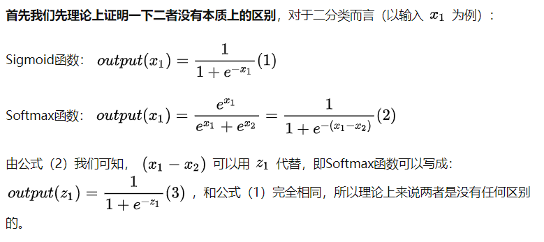

# `sigmoid函数和softmax函数小结`

本质上来说， `Softmax` 属于离散概率分布而 `Sigmoid` 是非线性映射。分类其实就是设定一个阈值，然后我们将想要分类的对象与这个阈值进行比较，根据比较结果来决定分类。 `Softmax` 函数能够将一个K维实值向量归一化，所以它主要被用于多分类任务； `Sigmoid` 能够将一个实数归一化，因此它一般用于二分类任务。特别地，当 `Softmax` 的维数 `K=2` 时， `Softmax` 会退化为 `Sigmoid` 函数。

