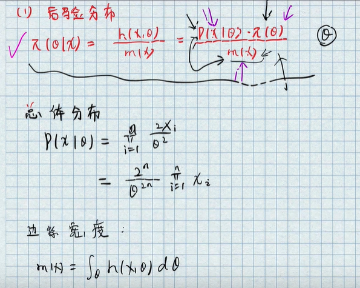

# 贝叶斯分类

## 朴素贝叶斯公式：

## 朴素贝叶斯的适用场景：

* 朴素贝叶斯分类最适合的场景就是文本分类、情感分析和垃圾邮件识别。这是因为朴素贝叶斯模型给定输出类别的情况下,假设属性之间相互独立，所以如果属性之间的独立性越强，朴素贝叶斯的算法效果也就越好。对于文本来说，一般分词后 词和词之间的关联性较低，因此效果会更好。这个是相比用于一些基于非文本的数值特征来说的， 一般数值特征之间的关联性会较强，不适合朴素贝叶斯。

## 朴素贝叶斯分类器的三个流程：

* `准备阶段：`
                 
  在这个阶段我们需要确定特征属性，比如对于通过“身高”为高、“体重”为中等、“鞋码”为中等，这些特征 `预测性别` 问题中，对每个特征属性进行适当划分，然后由人工对一部分数据进行分类，形成训练样本。
  
* `训练阶段:`
             
  这个阶段就是生成分类器，主要工作是计算每个类别在训练样本中的出现频率及每个特征属性划分对每个类别的条件概率。输入是特征属性和训练样本，输出是分类器。
    
* `应用阶段:`
               
  这个阶段是使用分类器对新数据进行分类。输入是分类器和新数据，输出是新数据的分类结果。

## 贝叶斯原理概念：
  

        
* `一、先验概率：`

  `是指根据以往经验和分析得到的概率。`例如如果我们对西瓜的色泽、根蒂和纹理等特征一无所知，按照常理来说，西瓜是好瓜的概率是60%。那么这个概率P（好瓜）就被称为先验概率。

* `二、后验概率：`

  `事情已经发生，要求这件事情发生的原因是由某个因素引起的可能性的大小。`例如假如我们了解到判断西瓜是否好瓜的一个指标是纹理。一般来说，纹理清晰的西瓜是好瓜的概率大一些，大概是75%。如果把纹理清晰当作一种结果，然后去推测好瓜的概率，那么这个概率P（好瓜|纹理清晰）就被称为后验概率。后验概率类似于条件概率（纹理清晰的条件下是好瓜的概率）。

* `三、条件概率:`
          
  `事件 A 在另外一个事件 B 已经发生条件下的发生概率，` 表示为 P(A|B)，读作“在 B 发生的条件下 A 发生的概率”。比如原因 A 的条件下，患有“贝叶死”的概率，就是条件概率。

* `3.1、条件概率和后验概率的区别：`后验概率就是一种条件概率，但是与其它条件概率的不同之处在于，它限定了目标事件为隐变量取值，而其中的条件为观测结果。 

* `四、似然概率：`

  比如知道这个瓜是好瓜，那么他纹理清晰的可能性是多少。

* `五、共轭先验概率分布`

# 贝叶斯分类相关公式：

## 离散型随机变量

对于贝叶斯分类来说，最终其实计算的还是 `最大化后验概率`

其中 `最大化后验估计` 其实是和 `θ` 相关的，所以下面的 `边缘密度 m(x)` 我们可以把它看成是 `常数项` ，所以其实就是相当于 `最大化 h(x,θ)`。

### `类条件独立假设`

根据 `贝叶斯公式` ：(`最大后验概率 p(y|x) ` 正比(`oc`)于 `p(x|y) * π(y)`，在求解  `p(x|y)` 时，需要先计算 `全概率公式 p(x,y)`  ，在无法计算 `全概率公式` 时，如何能得到 `p(y|x)`呢？) 

最终得到 `类条件独立假设`：

## `手写贝叶斯分类`

以二分类为例：

`原数据：`

`目的是想要预测数据如下：`

`关键在于：`

* 求解出最终 `buy_compute` 为 `yes` 的 `后验概率` 和 `buy_compute` 为 `no` 的 `后验概率`，然后对这两个后验概率进行比较，如果 `buy_compute` 为 `yes` 的 `后验概率` 更大，那么最终的预测标签为  `yes`。

`计算步骤：`

* 1、首先：计算 `先验概率` ：

  

* 2、然后通过 `类条件独立假设` 计算 `条件概率`:

  

  

  * 以 `p(age=youth|y=yes)` ：从表格中能发现 `age=youth` 的数据有 5 条，那么其中 `buy_computer = yes` 的数据只有 2 条，那么条件概率  `p(age=youth|y=yes) = 2/9` 。

  * 以 `p(income=medium|y=yes)` ：从表格中能发现 `income=medium` 的数据有 `5` 条，那么其中 `buy_computer = yes` 的数据只有 `4` 条，那么条件概率  `p(income=medium|y=yes) = 4/9` 。

  * ......

  * 最终得到：`p(x|y=yes) = 288/6561` , `p(x|y=yes) = 12/625`

3、计算 `后验概率`

  

  

可以看到最终的计算结果：`p(y=yes|x)` 的概率大于 `p(y=no|x)` 的概率，那么预测标签为 `yes`。

### `一图介绍贝叶斯分类`

  

## `对于离散值的分类，对于连续值的分类`

* 对于离散值我们直接进行概率计算，对于连续的值我们需要将其看成正态分布，然后计算均值和标准差，通过均值和标准差来求解概率。

## `Sklearn提供了3个朴素贝叶斯算法：`
  
* `高斯朴素贝叶斯：` 特征变量是连续变量，符合高斯分布，比如说人的身高，物体的长度。
                     
* `多项式朴素贝叶斯：` 特征变量是离散变量，符合多项分布，在文档分类中特征变量体现在一个单词出现的次数，或者是单词的 TF-IDF 值等。
                
* `伯努利朴素贝叶斯：` 特征变量是布尔变量，符合 0/1 分布，在文档分类中特征是单词是否出现。

## `TF-IDF值：`

* `词频 TF` 计算了一个单词在文档中出现的次数，它认为一个单词的重要性和它在文档中出现的次数呈正比。
    
      计算公式：词频 TF=单词出现的次数/该文档的总单词数
       
* `逆向文档频率 IDF` ，是指一个单词在文档中的区分度。它认为一个单词出现在的文档数越少，就越能通过这个单词把该文档和其他文档区分开。IDF 越大就代表该单词的区分度越大。
     
      计算公式：逆向文档频率 IDF=log(文档总数/该单词出现的文档数+1)
     
* `TF-IDF 实际上是词频 TF 和逆向文档频率 IDF 的乘积` 。这样我们倾向于找到 TF 和 IDF 取值都高的单词作为区分，即这个单词在一个文档中出现的次数多，同时又很少出现在其他文档中。这样的单词适合用于分类。

### `例子`
      
* 假设一个文件夹里一共有 10 篇文档，其中一篇文档有 1000 个单词，“this”这个单词出现 20 次，“bayes”出现了 5 次。“this”在所有文档中均出现过，而“bayes”只在 2 篇文档中出现过。我们来计算一下这两个词语的 TF-IDF 值。
  
  `针对“this”，计算 TF-IDF 值：`
      
      词频 TF =20/100=0.02
      逆向文档频率 IDF = log(10/10+1)=-0.0414
      
      TF-IDF=0.02*(-0.0414)=-8.28e-4。
  
  `针对“bayes”，计算 TF-IDF 值：`
  
      词频 TF =5/1000=0.005
      逆向文档频率 IDF = log(10/2+1)=0.5229
      
      TF-IDF=0.005 * 0.5229=2.61e-3。    
      
 ### `小结：  `

* `“bayes”的 TF-IDF 值要大于“this”的 TF-IDF 值。这就说明用“bayes”这个单词做区分比单词“this”要好。`

## `朴素贝叶斯基于 和 TF-IDF 的分类：`

* `TF-IDF` 用于计算出属于 xx 类文档，每个词的重要程度（连续变量），也可以通过设置阈值得到重要程度最高的n个词的 TF-IDF 值，搜集好这些值之后我们可以根据这些词（或者是重要程度）作为特征输入到朴素贝叶斯模型中。

  `sklearn` 中的 `朴素贝叶斯模型` 其实和 `KNN` 类似，他们的 `fit` 操作不是建立模型，而是类似于创造一个对照表: KNN的对照表是记录了样本所在的位置，当输入待预测数据时，通过周围样本进行多数表决，朴素贝叶斯相当于建立一个 P(y|a) .. p(y|d) 等条件概率，然后当输入待预测数据之后，根据参照表计算的概率值直接进行相乘计算，得到最后属于xx 类的概率。 

     
### `案例：如何对文档进行分类：`

* `流程：`
            
    文档输入 --> 对文档进行分词 --> 加载停用词 --> 计算单词权重 (准备阶段) --> 生成分类器 --> 分类器做预测 --> 计算正确率  (分类阶段)
  
  
  
  
  
  
  

