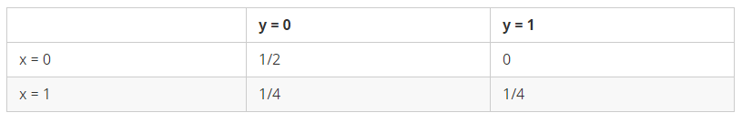
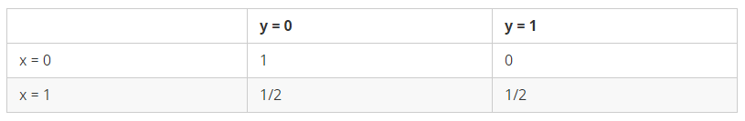

# `生成模型和判别模型：`

维基百科上 Generative 条目里面有个经典的案例：

* `假设有四个samples：`

    

### `生成式模型：`

* 生成式模型的世界：

    

  
    $P(x_0,y_0) = \frac{1}{2}$ ---------------  $P(x_1,y_1) = \frac{1}{4}$   
    
    $P(x_0)=\frac{1}{2}$    -------------------     $P(x_1)=\frac{1}{4}+\frac{1}{4}=\frac{1}{2}$ 

    $P(y_0)=\frac{3}{4}$ ------------------- $P(y_1)=\frac{1}{4}$ 

    $P(y_0|x_0) = \frac{P(x_0,y_0)}{P(x_0)} =\frac{\frac{1}{2}}{\frac{1}{2}}=1$ ---------------对应下面判别式的左上角

    $P(y_1|x_1) = \frac{P(x_1,y_1)}{P(x_1)} =\frac{\frac{1}{4}}{\frac{1}{2}}=\frac{1}{2}$ ---------------对应下面判别式的右下角

*   `可以看到生成模型是可以得到判别模型的，但是判别模型无法得到生成模型。`

* 并且有：
    $$\sum P(x,y)=1$$

### `判别式模型：`

* 判定式模型的世界：

    

    $$\sum\limits_{y}  P(y|x)=1$$

### `小结：`

* 生成模型对联合概率分布建模，判别模型对边缘概率分布建模。生成模型有更高的泛化能力和普适性，也就意味着更高的计算复杂度，他能帮助发现数据中新的特性。判别模型相对来说简单一点，只计算了条件概率。就信息量来讲，很明显上图，生成模型的信息量是高于下图判别模型的信息量的。

