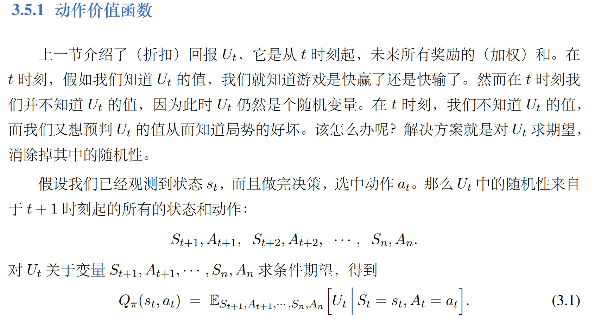
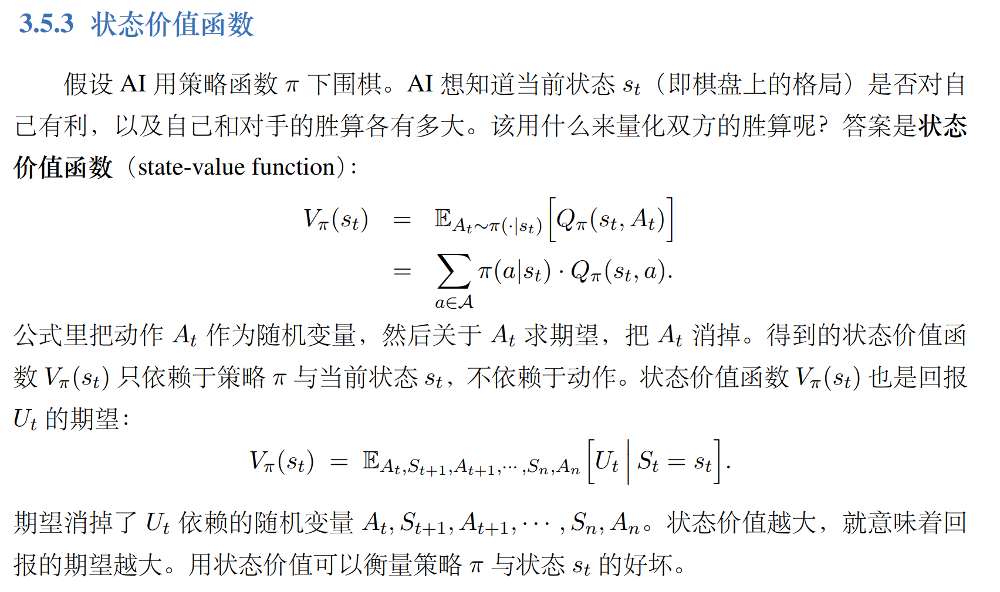

# `强化学习：`

## `动作价值函数：`

## `状态价值函数：`

* `状态价值函数：`
  
    

    这个公式的意思是，如果我们在时间步t时处于状态 ​$s_t​$​ ，并且按照策略π选择动作，那么我们从t时刻开始到结束的累积奖励 ​$U_t​​$ 的平均值是多少。这个平均值是对所有可能的动作和状态的随机变化进行求期望的结果。具体来说，我们要考虑从t时刻开始，每一步我们选择的动作 $A_t​,A_{t+1}​,…,A_n​$ ，以及每一步我们转移到的状态 ​$S_{t+1​},S_{t+2}​,…,S_n​$ ​，这些都是随机变量，它们的取值依赖于策略π和环境的转移概率。我们要对这些随机变量求条件期望，条件是我们已经知道了当前的状态 ​$S_t​=s_t​$ ​。这个条件期望就是状态价值函数 ​$V_π​(s_t​)​$ ，它反映了在状态 ​$s_t​$ ​下遵循策略 π 的优劣程度。
 

* `为什么当我们知道了当前的状态 ​$S_t​=s_t​$ ​，即使不知道后续的每一步状态转移和动作也可以计算 V 这个期望呢?`
 

    这是因为强化学习中的环境和策略都满足马尔可夫性质（Markov property），也就是说，下一个状态和动作只依赖于当前的状态和动作，而不依赖于之前的历史。这样，我们就可以用当前的状态和动作来预测未来的状态和动作，而不需要知道过去的状态和动作。这也就是为什么我们可以用贝尔曼方程来递归地计算状态价值函数或动作价值函数，因为每一步的价值都可以用下一步的价值来表示，而下一步的价值又只依赖于下一步的状态和动作。

* `为什么在强化学习中要涉及到动作价值函数和状态价值函数，动作价值函数中难道没有体现出状态价值吗？`

    在强化学习中，动作价值函数和状态价值函数都是重要的概念，它们都可以用来评估或指导行为。动作价值函数中确实包含了状态价值的信息，因为动作价值函数和状态价值函数之间有一个关系，就是：

    $$Q_π​(s_t​,a_t​)=E_{S_{t+1}}​​[R_{t+1}​+γV_π​(S_{t+1}​)∣S_t​=s_t​,A_t​=a_t​]$$

    这个方程表示，在策略π下，状态价值函数等于当前奖励加上下一个状态的折扣价值的期望。也就是说，动作价值函数可以看作是状态价值函数的一种扩展，它考虑了当前的动作选择对未来的影响。

    那么，为什么还要涉及到状态价值函数呢？这是因为有些情况下，我们只能观测到状态，而不能观测到动作，或者我们只关心状态的优劣，而不关心具体的动作选择。例如，在一个棋类游戏中，我们可能只能看到棋盘的局面，而不能看到对手的落子策略，或者我们只想知道某个局面对我们有利还是不利，而不想知道具体应该怎么走。这时候，状态价值函数就比较有用，它可以帮助我们评估或比较不同的状态。

* 状态价值函数对状态S积分有什么意义:

    

    