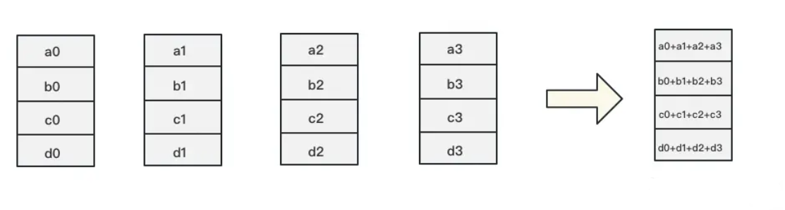
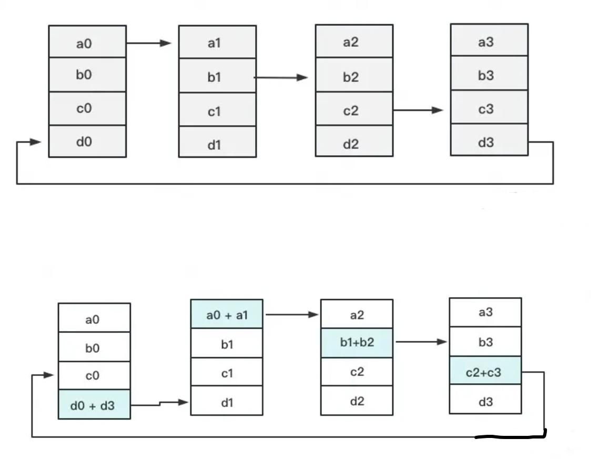
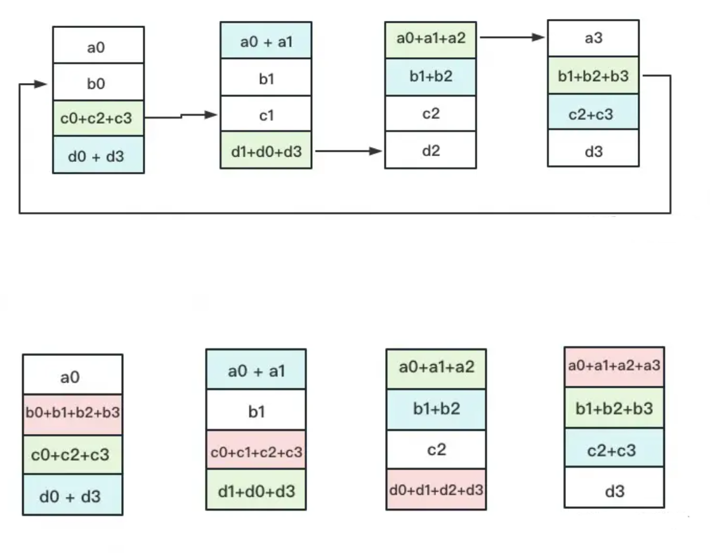
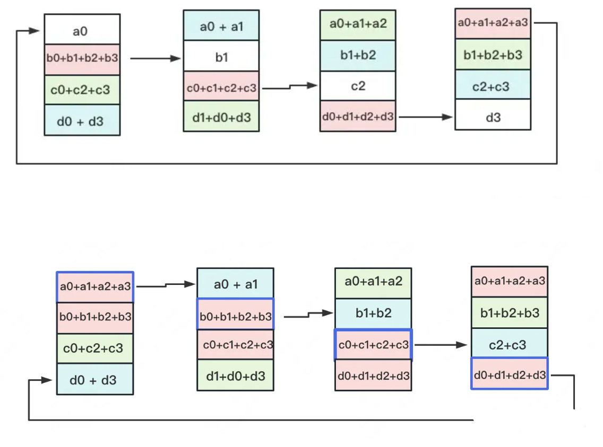
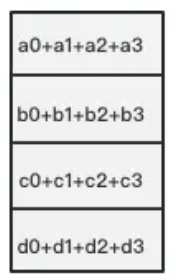

# AI 框架并行

利用AI集群，使机器学习算法更好地从大数据中训练出性能优良的大模型是分布式机器学习的目标。为了实现该目标，一般需要根据硬件资源与数据/模型规模的匹配情况，考虑对计算任务、训练数据和模型进行划分，进行分布式存储和分布式训练。下面将对现有的并行训练方法进行简要介绍。

## 数据并行

### 数据并行（DP）

* 整体架构:
    

    一个经典数据并行的过程如下：

    * 若干块计算GPU，如图中GPU0~GPU2；1块梯度收集GPU，如图中AllReduce操作所在GPU。

    * 在每块计算GPU上都拷贝一份完整的模型参数。
    * 把一份数据X（例如一个batch）均匀分给不同的计算GPU。
    * 每块计算GPU做一轮FWD和BWD后，算得一份梯度G。
    * 每块计算GPU将自己的梯度push给梯度收集GPU，做聚合操作。这里的聚合操作一般指梯度累加。当然也支持用户自定义。
    * 梯度收集GPU聚合完毕后，计算GPU从它那pull下完整的梯度结果，用于更新模型参数W。更新完毕后，计算GPU上的模型参数依然保持一致。
    * 聚合再下发梯度的操作，称为AllReduce。

    实现DP的一种经典编程框架叫“参数服务器”，在这个框架里，计算GPU称为Worker，梯度聚合GPU称为Server。在实际应用中，为了尽量减少通讯量，一般可选择一个Worker同时作为Server。比如可把梯度全发到GPU0上做聚合。需要再额外说明几点：

    * 1个Worker或者Server下可以不止1块GPU。
    * Server可以只做梯度聚合，也可以梯度聚合+全量参数更新一起做
    
    * 在参数服务器的语言体系下，DP的过程又可以被描述下图：

    

### 分布式数据并行(DDP)

* 受通讯负载不均的影响，DP一般用于单机多卡场景。因此，DDP作为一种更通用的解决方案出现了，既能多机，也能单机。DDP首先要解决的就是通讯问题：将Server上的通讯压力均衡转到各个Worker上。实现这一点后，可以进一步去Server，留Worker。

    目前最通用的AllReduce方法：Ring-AllReduce。

    如下图，假设有4块GPU，每块GPU上的数据也对应被切成4份。AllReduce的最终目标，就是让每块GPU上的数据都变成箭头右边汇总的样子。
    
    

    
    Ring-ALLReduce则分两大步骤实现该目标：Reduce-Scatter和All-Gather。

    * **Reduce-Scatter**

        定义网络拓扑关系，使得每个GPU只和其相邻的两块GPU通讯。每次发送对应位置的数据进行累加。每一次累加更新都形成一个拓扑环，因此被称为Ring。看到这觉得困惑不要紧，我们用图例把详细步骤画出来。
        

        
        一次累加完毕后，蓝色位置的数据块被更新，被更新的数据块将成为下一次更新的起点，继续做累加操作。

        

        3次更新之后，每块GPU上都有一块数据拥有了对应位置完整的聚合（图中红色）。此时，Reduce-Scatter阶段结束。进入All-Gather阶段。目标是把红色块的数据广播到其余GPU对应的位置上。

    * **All-Gather**
    
        如名字里Gather所述的一样，这操作里依然按照“相邻GPU对应位置进行通讯”的原则，但对应位置数据不再做相加，而是直接替换。All-Gather以红色块作为起点。

        

                
        以此类推，同样经过3轮迭代后，使得每块GPU上都汇总到了完整的数据，变成如下形式：

        

## 模型并行

模型并行，即模型被分割并分布在一个设备阵列上。通常有两种类型的并行：张量并行和流水线并行。张量并行是在一个操作中进行并行计算，如矩阵-矩阵乘法。流水线并行是在各层之间进行并行计算。因此，从另一个角度来看，张量并行可以被看作是层内并行，流水线并行可以被看作是层间并行。

### 张量并行：

* 张量并行训练是将一个张量沿特定维度分成 N 块，每个设备只持有整个张量的 1/N，同时不影响计算图的正确性。这需要额外的通信来确保结果的正确性。

    以一般的矩阵乘法为例，假设我们有 C = AB。我们可以将B沿着列分割成 [B0 B1 B2 ... Bn]，每个设备持有一列。然后我们将 A 与每个设备上 B 中的每一列相乘，我们将得到 [AB0 AB1 AB2 ... ABn] 。此刻，每个设备仍然持有一部分的结果，例如，设备(rank=0)持有 AB0。为了确保结果的正确性，我们需要收集全部的结果，并沿列维串联张量。通过这种方式，我们能够将张量分布在设备上，同时确保计算流程保持正确。

    

### 流水线并行

* 流水线并行的核心思想是，模型按层分割成若干块，每块都交给一个设备。

    在前向传递过程中，每个设备将中间的激活传递给下一个阶段。

    在后向传递过程中，每个设备将输入张量的梯度传回给前一个流水线阶段。这允许设备同时进行计算，并增加了训练的吞吐量。

    

    简单来讲就是：对一个网络层按照顺序先给他切分成若干份stage，然后给每个stage分配更小的micro batch，假设我们现在分成了4个stage，每个stage分了4个micro batch，那么第一个stage训练完第一个mirco 之后，会将输出的结果作为stage2的输入，并且stage1可以开始对第二个micro batch的训练，然后依次按照这样的方式进行传递

## 优化器并行

* 目前随着模型越来越大，单个GPU的显存目前通常无法装下那么大的模型了。那么就要想办法对占显存的地方进行优化。通常来说，模型训练的过程中，GPU上需要进行存储的参数包括了模型本身的参数，优化器状态，激活函数的输出值，梯度，以及一些零时的Buffer。数据的占比如下图所示：

    

    可以看到模型参数仅占一部分的，当进行混合精度运算时，其中模型状态参数(优化器状态 + 梯度+ 模型参数）占到了一大半以上。因此，我们需要想办法去除冗余数据。

    它的基本思想是，将优化器的计算分散到数据并行维度的不同设备上，而不是在每个设备上重复计算，举个例子：

    * 如果你使用数据并行，你可以将输入数据划分为三个子批量数据，并且在三个不同的设备上并行地执行相同的模型。

    * 这样，每个设备都需要存储和计算整个模型的参数和梯度，以及优化器的状态和更新。也就是说，每个设备都需要存储20个参数，20个梯度，20个优化器状态和20个优化器更新。这就是为什么说每一张卡会保存完整的梯度等参数的副本的原因。

    * 如果你使用优化器并行，你可以将模型的参数和梯度，以及优化器的状态和更新，按照层级划分为两个部分，并且将这些部分分别放在不同的设备上，。

    * 这样，每个设备只需要存储和计算一部分的参数和梯度，以及优化器的状态和更新。也就是说，每个设备只需要存储10个参数，10个梯度，10个优化器状态和10个优化器更新。这就是为什么说优化器并行可以减少内存占用，并且避免计算冗余的原因。

### Zero Redundancy Data Parallelism (ZeRO)

* 训练过程中GPU内存开销主要包含以下几个方面：

    * 模型状态内存（Model State Memory）：
        * 梯度
        * 模型参数
        * 优化器状态：当使用像Adam这样的优化器时，优化器的状态会成为GPU内存开销的大头。前面介绍的DP，TP， PP算法并没有考虑这个问题。
    * 激活内存（Activation Memory）：在优化了模型状态内存之后，人们发现激活函数也会导致瓶颈。激活函数计算位于前向传播之中，用于支持后向传播。
    * 碎片内存（Fragmented Memory）：深度学习模型的低效有时是由于内存碎片所导致的。在模型之中，每个张量的生命周期不同，由于不同张量寿命的变化而会导致一些内存碎片。由于这些碎片的存在，会导致即使有足够的可用内存，也会因为缺少连续内存而使得内存分配失败。ZeRO 根据张量的不同寿命主动管理内存，防止内存碎片。

        

    不管采用三种方法的哪一种，ZeRO简单理解就是给定N个设备，然后把一堆data等分到这些设备上，每个设备只存1/N的数据量，并且每次也只负责更新这1/N的数据。

    因为对数据做了划分，ZeRO在每一层都需要有通信操作。我们考虑ZeRO在某一层的具体操作：

    * 在forward的时候，会首先使用all-gather让每个设备拥有该层完整的模型权重，然后计算得到输出，最后每个设备会只保留原来的权重，即把all-gather过来的权重扔掉，这样可以节省开销。

    * 在backward的时候，同样会先all-gather该层的所有权重，然后计算梯度，最后也会把梯度进行划分，每个设备上只会存1/N对应的梯度数据。

    注意ZeRO对数据划分方式并没有什么具体的要求，可以是随意划分，因为最后反正会用all-gather使得所有设备商都有用完整的数据；当然，也可以使用前面提到的Tensor Parallelism的划分方式，这样一来可以有效降低通信开销，进一步提高效率。

## 并行任务的混合协同：

### 数据并行+模型并行+流水线并行

* 首先，你需要将你的模型按照层级划分为多个阶段，并且将这些阶段分别放在不同的设备上，这就是模型并行的部分。
* 然后，你需要将你的输入数据划分为多个小批量数据，并且将这些小批量数据分发给不同的设备组，每个设备组包含了所有的模型阶段，这就是数据并行的部分。
* 接下来，你需要将每个小批量数据再划分为更小的微批量数据，并且让每个设备组内的设备同时处理不同的微批量数据，并且在每个阶段结束后将输出传递给下一个设备，这就是流水线并行的部分。

## 参考文章：

https://arxiv.org/pdf/1811.06965.pdf

https://zhuanlan.zhihu.com/p/116484241

https://zhuanlan.zhihu.com/p/618865052

https://www.changping.me/2022/04/04/ai-distributed-training-coll-lang/

https://www.changping.me/2022/04/17/ai-distributed-training-framework-1/

https://www.cnblogs.com/marsggbo/p/16871789.html

https://basicv8vc.github.io/posts/zero/

https://zh.d2l.ai/chapter_computational-performance/parameterserver.html

https://insujang.github.io/2022-06-11/parallelism-in-distributed-deep-learning/

https://arxiv.org/pdf/1910.02054.pdf