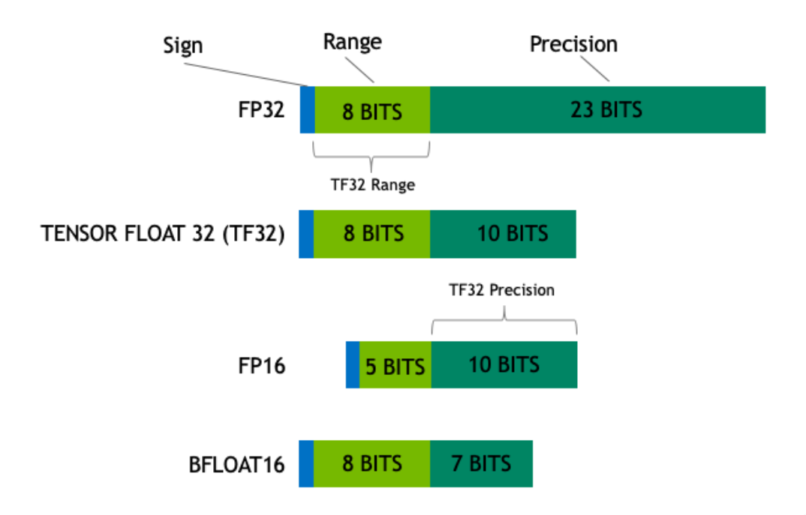

## 大模型相关内容

## 大模型工作原理-decoder-only

## 模型量化（精度）

* https://huggingface.co/blog/zh/hf-bitsandbytes-integration

* 模型的大小由其参数量及其精度决定，精度通常为 float32、float16 或 bfloat16 之一

    

* 什么是量化：https://hub.baai.ac.cn/view/22301

    举例来说，假设我们有分别有数据类型I5和数据类型I3，I5可以表示的数值为[0, 1, 2, 3, 4, 5]，I3可以表示的数值为[0, 2, 4]。通过以下两个步骤将数据类型从I5转换为I3：

    1）将数据范围从I5标准化为I3；

    2）用I3中最接近的数值表示原始数据 。

    例如，我们将使用数据类型I5表示的向量[3, 1, 2, 3]量化到数据类型I3的过程如下：

    1）找到向量[3, 1, 2, 3]的最大的绝对值->3；

    2）向量[3, 1, 2, 3]除以最大值3：[3, 1, 2, 3]->[1, 0.33, 0.66, 1.0]；

    3）将向量[1, 0.33, 0.66, 1.0]与I3的数据范围4相乘：[1, 0.33, 0.66, 1.0]->[4.0, 1.33, 2.66, 4.0]；

    4）将向量[4.0, 1.33, 2.66, 4.0]中的每个值用I3中最接近的数值表示：[4.0, 1.33, 2.66, 4.0] -> [4, 0, 2, 4]。

    这样，我们就将I5类型表示的[3, 1, 2, 4]量化到了I3类型表示的[4, 0, 2, 4]。

* 提高量化精度的方法