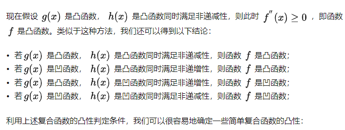

# `神经网络为什么大多都是非凸的`

* 深度神经网络是一个高度非线性的模型，其风险函数是非凸函数，因此风险最小化的问题是一个非凸优化的问题。

* 在一些问题中我们经常使用的风险函数就是比如 `均方误差、交叉熵` 这种凸函数，即使我们最后使用的损失函数在表达式上是凸函数，但是前面的 n 个神经网络层经过了 N 个激活函数，这时候的损失函数相当于 N 个激活函数的复合，即使前面的 N 个激活函数是凸函数，最后的优化函数也可能是非凸的。

* `当满足下面两个图片：`
  
    

    

    中的保凸的定义的时候，也就是对应下图的第一条和第二条的时候最后的结果是凸的。
    
    比如所以的激活函数都使用 `relu` ，最后的损失函数使用 `交叉熵` ，这个时候的优化问题就是凸问题，但是一般情况下我们会加入 `sigmoid` 或者 `softmax` 作为最后的输出层，这使得我们的最后优化问题为 `非凸优化问题`。