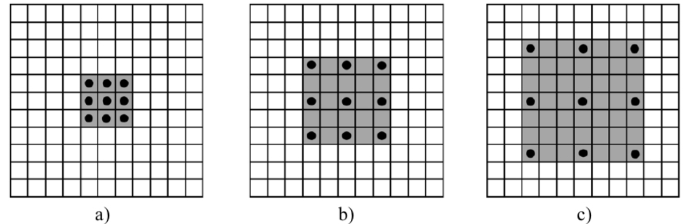

# `卷积类型：`

## `卷积：`

* `卷积计算图：`

    

## `空洞卷积：`

* `普通的卷积和空洞卷积之间的关系:`

    

    空洞卷积可以看作是普通卷积的一种扩展，它在卷积核中引入了一个称为扩张率或空洞数的参数，用来控制卷积核处理数据时各值的间距。空洞卷积的优点是可以在不增加参数量和降低分辨率的情况下，扩大感受野，从而捕获更多的全局语义信息。空洞卷积的缺点是可能导致局部信息丢失和远距离信息无关性，因为它稀疏地采样输入信号，使得邻近的像素和远距离的像素之间缺少依赖。

    * `a` 是普通的卷积过程(dilation rate = 1),卷积后的感受野为3
  
    * `b` 是dilation rate = 2的空洞卷积,卷积后的感受野为5
  
    * `c` 是dilation rate = 3的空洞卷积,卷积后的感受野为8
  
* `空洞卷积的感受野计算公式如下：`

    假设空洞卷积的卷积核大小为 k ，空洞数为 d ，则其等效卷积核大小 k’ 为：

    $$k'=k+(k-1)(d-1)$$
    设当前层的感受野为 R ，上一层的感受野为 R’ ，步长为 s ，则当前层的感受野计算公式为：

    $$R=R'+(k'-1)s$$

## `空洞卷积的优缺点：`

* `空洞卷积的优点有：`

    * 可以在不降低分辨率和增加计算量的情况下，扩大感受野，从而捕获更多的全局语义信息。

    * 可以用一个小卷积核来模拟一个大卷积核的效果，而且不需要增加参数量和计算量。

    * 可以通过设置不同的扩张参数，来获取多尺度的上下文信息，从而提高模型的性能和泛化能力。

*  `空洞卷积的缺点有：`

   * 可能导致局部信息丢失和远距离信息无关性，因为它稀疏地采样输入信号，使得邻近的像素和远距离的像素之间缺少依赖。

   * 可能导致gridding问题，也就是网格效应或者棋盘问题，因为它在卷积核中注入了空洞，使得某一层的结果中，邻近的像素是从相互独立的子集中卷积得到的，相互之间没有相关性。

   * 可能导致计算过程的计算量比较大，因为它保持了特征图的尺寸不变，而没有进行下采样或者上采样操作。

## `参考：`

* https://zhuanlan.zhihu.com/p/113285797