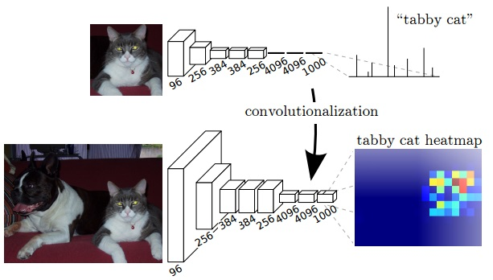
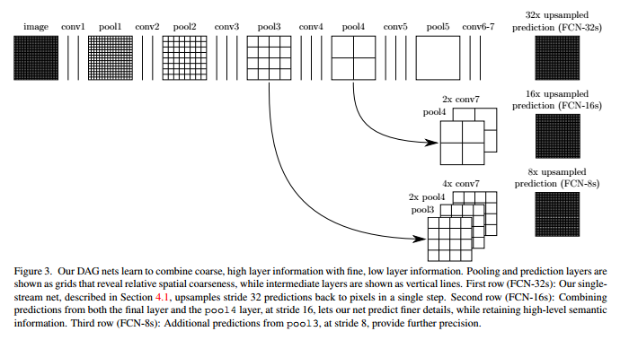

# `FCN 全连接网络：`

## `FCN相较CNN的改进：`

* 通常cnn网络在卷积之后会接上若干个全连接层，将卷积层产生的特征图（feature map）映射成为一个固定长度的特征向量。一般的CNN结构适用于图像级别的分类和回归任务，因为它们最后都期望得到输入图像的分类的概率，如ALexNet网络最后输出一个1000维的向量表示输入图像属于每一类的概率。

* FCN对图像进行像素级的分类，从而解决了语义级别的图像分割问题。与经典的CNN在卷积层使用全连接层得到固定长度的特征向量进行分类不同，FCN可以接受任意尺寸的输入图像，采用反卷积层对最后一个卷基层的特征图（feature map）进行上采样，使它恢复到输入图像相同的尺寸，从而可以对每一个像素都产生一个预测，同时保留了原始输入图像中的空间信息，最后奇偶在上采样的特征图进行像素的分类。全卷积网络(FCN)是从抽象的特征中恢复出每个像素所属的类别。即从图像级别的分类进一步延伸到像素级别的分类。

    

    FCN将传统CNN中的全连接层转化成一个个的卷积层。如上图所示，在传统的CNN结构中，前5层是卷积层，第6层和第7层分别是一个长度为4096的一维向量，第8层是长度为1000的一维向量，分别对应1000个类别的概率。FCN将这3层表示为卷积层，卷积核的大小(通道数，宽，高)分别为（4096,7,7）、（4096,1,1）、（1000,1,1）。所有的层都是卷积层，故称为全卷积网络。

## `FCN网络结构：`

* 如下图所示，FCN网络的流程如下

  * 首先输入图像，经过pool1，尺寸变为原来尺寸的一半。

  * 在经过pool2，尺寸变为原来的1/4。

  * 接下来经过pool3、4、5层，大小分别变为原来的1/8、1/16、1/32。

  * 经过conv6-7，输出的尺寸依然是原图的1/32。

  * FCN-32s最后使用反卷积，使得输出图像的密集程度和原图相同。

  * 然后把pool4的特征图拿出来，把conv7的尺寸扩大两倍至原图的1/16，将他俩做融合，再通过反卷积扩大16倍得到原图一样的尺寸。

  * 最后将pool3的特征图拿出来，把conv7的尺寸扩大两倍、把conv4的尺寸扩大两倍至原图的1/8，三者融合通过反卷积得到原图尺寸。

    

* `网络结构图下：`输入可为任意尺寸图像彩色图像；输出与输入尺寸相同，`深度为：20类目标+背景=21`
  
    不难发现FCN网络前面的部分和VGG16结构一样，先是两个卷积一个池化，接两个卷积一个池化，然后跟上三组三个卷积一个池化。最后的全连接层换成了全卷积层。将最后一个全卷积层得到的特征图反卷积，然后反卷积与1/16的特征图拼接，再将得到的特征图反卷积与1/8的特征图拼接，最后反卷积成原图尺寸。

    

## `训练`

* 训练过程分为四个阶段，也体现了作者的设计思路，值得研究。

### `第1阶段：`

* 以经典的分类网络为初始化。最后两级是全连接（红色），参数弃去不用。

    

    如果是这样的结构相当于FCN退化成了一个普通的CNN分类器，无法进行像素级别的分割。

    为了进行像素级别的分割，FCN需要在最后一个卷积层之后使用反卷积层进行上采样，将特征图恢复到输入图像相同的尺寸，从而实现逐像素的分类。这样的话，每个通道的值就代表了每个像素点属于某个类别的概率。

### `第2阶段：`

* 从特征小图`（16*16*4096）`预测分割小图`（16*16*21）` 把channel数从4096转成你要预测的分类数，之后直接升采样为大图。

    反卷积（橙色）的步长为32，这个网络称为FCN-32s。
    

    训练FCN-32s模型，它是将预训练的VGG-16网络转换为全卷积网络，并在最后一层添加一个32倍的反卷积层，将特征图恢复到输入图像的尺寸。这个阶段不需要进行预测，只需要直接上采样和分类即可。
### `第3阶段：`

* 升采样分为两次完成（橙色×2）。
  
    在第二次升采样前，把第4个pooling层（绿色）的预测结果（蓝色）融合进来。使用跳级结构提升精确性。
    
    第二次反卷积步长为16，这个网络称为FCN-16s。
    

    FCN的第二个训练阶段是为了训练FCN-16s模型，它是在FCN-32s模型的基础上进行改进的。FCN-16s模型的特点是在上采样过程中，将pool4层的特征图和pool5层上采样后的特征图进行融合，以增加空间信息和细节信息。

    为了实现这种融合，需要先将pool5层的特征图进行2倍上采样，然后与pool4层的特征图进行逐元素相加（或拼接）。但是pool5层的特征图是4096通道的，而pool4层的特征图是512通道的，它们不能直接相加（或拼接）。因此，需要在pool5层之后添加一个卷积层，将4096通道降维到21通道，也就是预测分割小图`（16*16*21）`。

    这样做的好处是，可以使pool5层和pool4层的特征图具有相同的通道数，并且可以提前对每个像素点进行分类预测，从而提高分割精度。

### `第4阶段：`

* 升采样分为三次完成（橙色×3）。

    进一步融合了第3个pooling层的预测结果。

    第三次反卷积步长为8，记为 `FCN-8s`。

    

    第三个阶段是为了训练FCN-8s模型，它是在FCN-16s模型的基础上进行改进的。FCN-8s模型的特点是在上采样过程中，将pool3层的特征图和pool4层、pool5层上采样后的特征图进行融合，以增加更多的空间信息和细节信息。

    为了实现这种融合，需要先将pool5层的特征图进行2倍上采样，然后与pool4层的特征图进行逐元素相加（或拼接），再将相加后的特征图进行2倍上采样，然后与pool3层的特征图进行逐元素相加（或拼接）。但是pool5层、pool4层和pool3层的特征图都有不同的通道数，分别是4096、512和256，它们不能直接相加（或拼接）。因此，需要在pool5层、pool4层和pool3层之后分别添加一个卷积层，将通道数降维到21，也就是预测分割小图`（16*16*21）`、`（32*32*21）`和`（64*64*21）`。

    这样做的好处是，可以使不同层次的特征图具有相同的通道数，并且可以提前对每个像素点进行分类预测，从而提高分割精度。

    较浅层的预测结果包含了更多细节信息。比较2,3,4阶段可以看出，跳级结构利用浅层信息辅助逐步升采样，有更精细的结果。

    

## `参考：`
* FCN -- 语义分割的里程碑之作: https://zhuanlan.zhihu.com/p/384377866
* 【图像分割】Fully Convolutional Networks for Semantic Segmentation: https://blog.csdn.net/shenxiaolu1984/article/details/51348149
* 全卷积神经网络(FCN)详解: https://zhuanlan.zhihu.com/p/268205305
* 语义分割模型之DeepLabv3+: https://zhuanlan.zhihu.com/p/62261970
