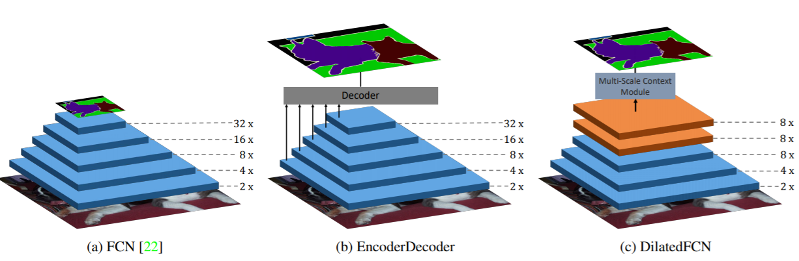

# `deeplabv3`

## `语义分割模型：`

* 与检测模型类似，语义分割模型也是建立是分类模型基础上的，即利用CNN网络来提取特征进行分类。对于CNN分类模型，一般情况下会存在stride>1的卷积层和池化层来降采样，此时特征图维度降低，但是特征更高级，语义更丰富。这对于简单的分类没有问题，因为最终只预测一个全局概率，对于分割模型就无法接受，因为我们需要给出图像不同位置的分类概率，特征图过小时会损失很多信息。其实对于检测模型同样存在这个问题，但是由于检测比分割更粗糙，所以分割对于这个问题更严重。但是下采样层又是不可缺少的，首先stride>1的下采样层对于提升感受野非常重要，这样高层特征语义更丰富，而且对于分割来说较大的感受野也至关重要；另外的一个现实问题，没有下采样层，特征图一直保持原始大小，计算量是非常大的。相比之下，对于前面的特征图，其保持了较多的空间位置信息，但是语义会差一些，但是这些空间信息对于精确分割也是至关重要的。这是语义分割所面临的一个困境或者矛盾，也是大部分研究要一直解决的。

## `FCN 到 Deeplabv3:`

* 对于这个问题，主要存在两种不同的解决方案，如图3所示。其中a是原始的FCN（Fully Convolutional Networks for Semantic Segmentation），图片送进网络后会得到大小降为32x的特征图，虽然语义丰富但是空间信息损失严重导致分割不准确，这称为FCN-32s，另外paper还设计了FCN-8s，大致是结合不同level的特征逐步得到相对精细的特征，效果会好很多。为了得到高分辨率的特征，一种更直观的解决方案是b中的EncoderDecoder结构，其中Encoder就是下采样模块，负责特征提取，而Decoder是上采样模块（通过插值，转置卷积等方式），负责恢复特征图大小，一般两个模块是对称的，经典的网络如U-Net（U-Net: Convolutional Networks for Biomedical Image Segmentation。而要直接将高层特征图恢复到原始大小是相对困难的，所以Decoder是一个渐进的过程，而且要引入横向连接（lateral connection），即引入低级特征增加空间信息特征分割准确度，横向连接可以通过concat或者sum操作来实现。另外一种结构是c中的DilatedFCN，主要是通过空洞卷积（Atrous Convolution）来减少下采样率但是又可以保证感受野，如图中的下采样率只有8x，那么最终的特征图语义不仅语义丰富而且相对精细，可以直接通过插值恢复原始分辨率。天下没有免费的午餐，保持分辨率意味着较大的运算量，这是该架构的弊端。这里介绍的DeepLabv3+就是属于典型的DilatedFCN，它是Google提出的DeepLab系列的第4弹。

    

* 这里的 FCN 不是普通的卷积神经网络，而是特指一类完全基于卷积神经网络实现的语义分割网络。相比于传统的卷积神经网络，FCN采用了一系列的卷积操作和上采样操作来将特征图逐步恢复到输入图像的大小，从而实现对每个像素点的语义分割。
  
* 并且FCN引入了跳跃式连接，通过跳跃式连接（skip connection）将底层卷积层的特征与高层卷积层的特征进行融合，在FCN中，作者提出了三种不同的模型：FCN-32s，FCN-16s和FCN-8s。其中，FCN-32s只做了一次跳跃连接，将conv7层经过反卷积后得到的特征图与原始图片大小相同；FCN-16s做了两次跳跃连接，将conv7层经过反卷积后得到的特征图与pool4层的特征图进行拼接，然后再进行反卷积；FCN-8s做了三次跳跃连接，将conv7层经过反卷积后得到的特征图与pool4层和pool3层的特征图分别进行拼接，然后再进行反卷积。其中：FCN-8s的分割结果比FCN-32s和FCN-16s更精细和准确。

## `空间金字塔池化（ASPP）:`

## `参考：`

https://zhuanlan.zhihu.com/p/62261970