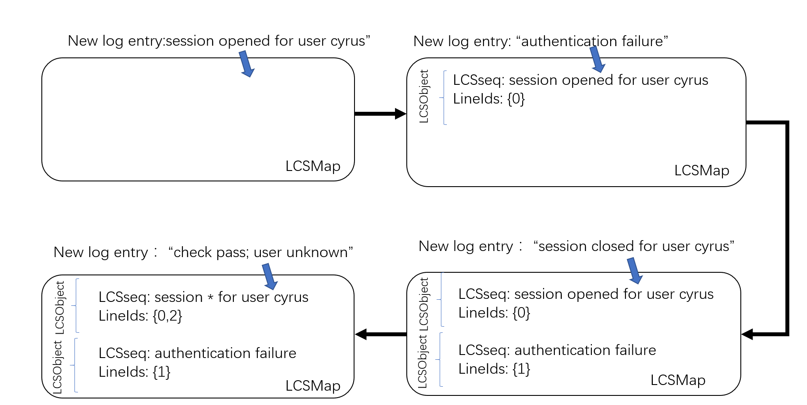

# `日志异常检测：`

## `流程框架简介：`

对于日志异常检测，可以将其分为四个步骤：

* `1、日志搜集：`大规模系统通常会生成日志来记录系统状态和运行时信息，每个日志都包括时间戳和指示发生了什么的日志消息。

* `2、日志解析：`日志是非结构化的，包含自由形式的文本。日志解析的目的是提取一组事件模板，从而可以构造原始日志。更具体地说，每个日志消息都可以被解析成带有一些特定参数(可变部分)的事件模板(恒定部分)。如图1所示，第四条日志消息(日志4 )被解析为"Event2"，事件模板=》"Received block * of size * from *"

  * `2.1、以 spell 为例，解析日志的完整过程如下：`

    `2.1.1、`初始化，包括(1)日志对象 LCSObject ，包括日志模板 LCSseq 和行数列表 lineIds ；(2)存放所有日志对象的列表 LCSMap 。

    `2.1.2、`流式的读取日志

    `2.1.3、`当读取到一个新的日志条目之后，遍历 LCSMap ，寻找该日志与所有 LCSObject 的最大公共子序列，如果子序列的长度大于日志序列长度的一半，则认为该日志该与日志键匹配。如果找到匹配的日志对象，跳转5，如果没有，或者 LCSMap 为空，则跳转第4步；

    `2.1.4、`将该行日志初始化为一个新的 LCSObject ，放入列表 LCSMap 中。

    `2.1.5、`将该行日志更新到匹配的 LCSObject 的行数列表 lineIds 中，并且更新 LCSseq 。

    `2.1.6、`跳转到第2步，直到日志读取完毕。

    

* `2.3、特征提取：`将日志解析成单独的事件后，我们需要进一步将它们编码成数字特征向量，从而可以应用机器学习模型。为此，我们首先使用不同的分组技术将原始日志分割成一组日志序列，包括固定窗口、滑动窗口和会话窗口。然后，对于每个日志序列，我们生成一个特征向量(事件计数向量)，表示每个事件的发生次数。所有特征向量一起可以形成特征矩阵，即事件计数矩阵

* `2.4、异常检测：`最后，可以将特征矩阵馈送给机器学习模型进行训练，从而生成异常检测模型。所构建的模型可用于识别新进入的日志序列是否异常。

### 以 `deeplog` 为例：

* `1、`将 `log` 文件转 `deeplog` 中 `hdfs_train` 中的 `id` 形式的 [思路](https://github.com/wuyifan18/DeepLog/issues/35)：

    * `1.1、`首先使用 `spell` 或者 [`drain3`](https://github.com/ying1016/Drain3) 等工具将日志文件进行分析，如上述的最大公共子序列等方法进行聚类，将每条日志的类别进行一个划分，生成一个解析文件，其中最重要的是给每一条日志分配了一个聚类的 `id` 。

    * `1.2、`然后根据某种规则，可以是根据块信息，或者按照时间序列或者其他方法对数据进行切割，比如按照一定的时间范围对日志解析文件进行切割如5分钟时间段，只保留切割这段解析文件的 `id`，如 `[5 5 5 6 7 8 8 ]` ，每个时间段为一个样本，这样就成功提取出了 `id`。

* `2、`然后就是使用 `LSTM` 来对样本进行训练学习。

## `参考：`

* `基于系统日志分析进行异常检测：`https://github.com/AmateurEvents/article/issues/2

* `基于LSTM深度模型实现系统日志异常检测：`https://saucer-man.com/machine_learning/475.html#cl-8

* `基于Log的异常检测-初印象：`https://zecoo.github.io/hugo/posts/research/2021-11-04-%E5%9F%BA%E4%BA%8Elog%E7%9A%84%E5%BC%82%E5%B8%B8%E6%A3%80%E6%B5%8B-%E5%88%9D%E5%8D%B0%E8%B1%A1/

* `项目案例1：`https://github.com/wuyifan18/DeepLog

* `项目案例2：`https://github.com/saucer-man/Dlog

* `项目案例3：`https://acmccs.github.io/papers/p1285-duA.pdf

* `deeplog 论文：`https://acmccs.github.io/papers/p1285-duA.pdf
