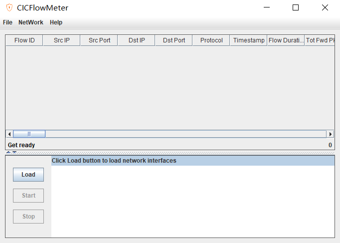

# `cicflowmeter-4 工具使用`

* `1、解压 cicflowmeter-4.zip 文件：`

    双击 `bin` 目录下的 `CICFlowMeter.bat` 文件，选择 `offline` 离线转换，再将 `pcap` 文件选中点击 `OK` 按钮即可成功转换

    

### `安装：`

1、下载包：

    git clone https://github.com/datthinh1801/cicflowmeter.git
    cd cicflowmeter
    python3 setup.py install

2、安装 WinPcap_4_1_3

3、复制 jnetpcap.dll 到 C:\Windows\System32

### `注意事项：`

* `1、`路径问题，如果目录中存在中文路径可能存在 问题

* `2、`pcap包不完整也会产生无法转换的问题，可以通过如下方法检查pcap包是否完整

        在bin目录下打开cmd
        cfm.bat input.pcap output.csv

* 如果运行结果输出为bad dump file format，则表明该输入pcap数据包不完整，可以尝试用wireshark读取该pcap包，并重新导出为Wireshark/tcpdump/**.pcap，重新进行转换。

### `数据标签的填充：`

* https://github.com/ahlashkari/CICFlowMeter/issues/109

## `参考：`

* `使用CICFlowMeter解析pcap文件: `https://blog.csdn.net/weixin_44700621/article/details/121993521]
  